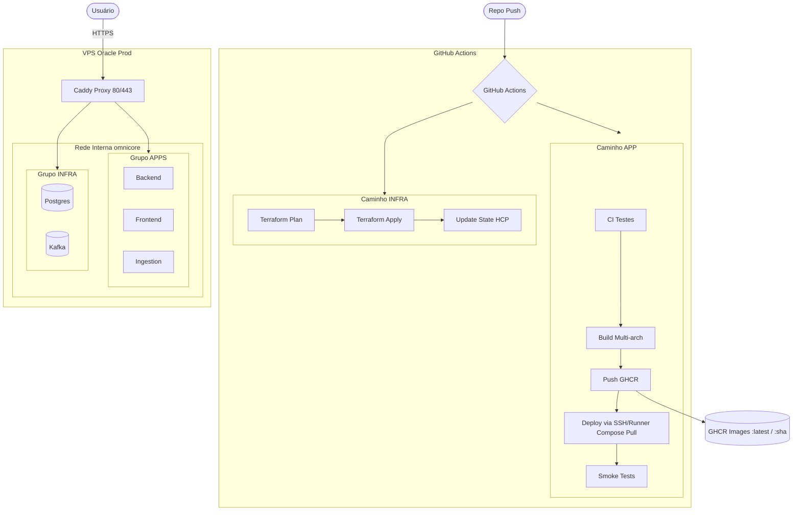

# Fluxo de Infraestrutura e CI/CD - OminiCore

```mermaid
flowchart TD
    Start([Repo Push]) --> GHA{GitHub Actions}

    subgraph GHA_Block [GitHub Actions]
        GHA --> APP_Flow
        GHA --> INFRA_Flow

        subgraph APP_Flow [Caminho APP]
            CI[CI Testes] --> Build[Build Multi-arch]
            Build --> PushGHCR[Push GHCR]
            PushGHCR --> Deploy[Deploy via SSH/Runner Compose Pull]
            Deploy --> Smoke[Smoke Tests]
        end

        subgraph INFRA_Flow [Caminho INFRA]
            TFPlan[Terraform Plan] --> TFApply[Terraform Apply]
            TFApply --> TFState[Update State HCP]
        end
    end

    PushGHCR --> GHCR[(GHCR Images :latest / :sha)]

    subgraph VPS [VPS Oracle Prod]
        Caddy[Caddy Proxy 80/443]
        
        subgraph InternalNet [Rede Interna omnicore]
            subgraph AppsGroup [Grupo APPS]
                Backend[Backend]
                Frontend[Frontend]
                Ingestion[Ingestion]
            end
            
            subgraph InfraGroup [Grupo INFRA]
                Postgres[(Postgres)]
                Kafka[(Kafka)]
            end
        end
        Caddy --> AppsGroup
        Caddy --> InfraGroup
    end

    User([Usuário]) -->|HTTPS| Caddy
```
