# OminiCore

> Sistema de gestão leve e rápido para **publicação de produtos no Mercado Livre e gestão de catálogo multi-produto**, com integração nativa ao ML.
> Monorepo com API Java (Spring Boot 4 + Modulith), worker Go (ingestão) e frontend React (Vite + Tailwind).


<!-- VALIDAR: Java 25 e PostgreSQL 16 seguem Dockerfile/CI/compose. Conferir <java.version> no pom.xml e a imagem do postgres nos composes. -->

---

## Índice

1. [Visão geral](#1-visão-geral)
2. [Principais funcionalidades](#2-principais-funcionalidades)
3. [Arquitetura da solução](#3-arquitetura-da-solução)
4. [Diagrama de arquitetura](#4-diagrama-de-arquitetura)
5. [Estrutura de pastas](#5-estrutura-de-pastas)
6. [Tecnologias utilizadas](#6-tecnologias-utilizadas)
7. [Padrões arquiteturais adotados](#7-padrões-arquiteturais-adotados)
8. [Orquestração de IA e Quality Harness](#8-orquestração-de-ia-e-quality-harness)
9. [Modelo de dados](#9-modelo-de-dados)
10. [Fluxo de integração ML](#10-fluxo-de-integração-ml)
11. [Fluxo de navegação](#11-fluxo-de-navegação)
12. [Fluxo de requisições HTTP](#12-fluxo-de-requisições-http)
13. [Gerenciamento de estado](#13-gerenciamento-de-estado)
14. [Estratégia de cache e eventos](#14-estratégia-de-cache-e-eventos)
15. [Tratamento de erros](#15-tratamento-de-erros)
16. [Configurando o ambiente](#16-configurando-o-ambiente)
17. [Executando o projeto](#17-executando-o-projeto)
18. [Build e CI/CD](#18-build-e-cicd)
19. [Convenções do projeto](#19-convenções-do-projeto)

---

## 1. Visão geral

### Objetivo de negócio

O OminiCore é um ERP leve focado em **publicar e gerenciar produtos no Mercado Livre** (catálogo multi-produto, multi-segmento — ex.: multimídia, comunicação visual, impressão), com integração nativa ao ML. O MVP combina publicação automatizada de produtos, sync de estoque/preço via Kafka e um dashboard de gestão.

### Problemas que resolve

| Problema | Como o sistema resolve |
| -------- | ---------------------- |
| Publicar produtos no ML é manual, um a um | Publicação em lote via API do ML, com status de cada item |
| Estoque e preço ficam desatualizados no ML | Sync automático via worker Go + Kafka (< 5 min) |
| Pedidos do ML chegam por e-mail e precisam ser digitados | Webhooks do ML → worker → Kafka → backend cria pedido automaticamente |
| Não há visão centralizada do negócio | Dashboard com KPIs: vendas, estoque baixo, pedidos pendentes, resumo ML |
| Catálogo de produtos sem gestão | CRUD de catálogo com categorias, preços, estoque e multi-segmento |

### Personas

| Persona | O que faz |
| ------- | --------- |
| Vendedor/Lojista | Publica produtos no ML, gerencia catálogo, acompanha pedidos |
| Gestor | Vê dashboard com KPIs, toma decisões rápidas |
| Operador | Gerencia estoque, preços e integrações |

---

## 2. Principais funcionalidades

### MVP — Integração Mercado Livre
- Publicação de produtos no ML (individual e em lote)
- Sync automático de estoque (< 5 min)
- Sync automático de preço (< 5 min)
- Recebimento de pedidos via webhooks
- Dashboard de resumo ML (produtos publicados, vendas, erros)

### MVP — Dashboard
- Cards de KPI (vendas do dia, receita, estoque baixo, pedidos pendentes)
- Gráfico de vendas (7d / 30d / 90d) com comparativo
- Alertas de estoque baixo
- Lista de pedidos recentes
- Widget de resumo ML

### Catálogo de produtos
- CRUD de produtos com categorias, preços, estoque
- Multi-segmento (multimídia, comunicação visual, impressão, etc.)
- Imagens por produto
- Status de publicação ML por produto

### Gestão de estoque
- Controle de estoque por produto
- Alertas de estoque baixo
- Ajustes manuais e automáticos (via sync ML)
- Histórico de movimentações (SALE, ADJUSTMENT, ML_SALE, RETURN)

### Gestão de pedidos
- Pedidos internos e do ML em lista única
- Status do pedido (Novo, Processando, Enviado, Entregue, Cancelado)
- Detalhe do pedido com itens, valores e rastreio

---

## 3. Arquitetura da solução

O repositório é um **monorepo** com três aplicações independentes, uma pasta de infraestrutura de produção (`infra/`) e uma pasta de documentação (`docs/`).

| Aplicação | Stack | Papel |
| --------- | ----- | ----- |
| `backend/` | Java 25 + Spring Boot 4.0.7 + Modulith (Maven) | API REST — domínio, casos de uso, persistência, integração ML |
| `ingestion/` | Go 1.22 + kafka-go | Worker — webhooks ML, sync estoque/preço, consumer Kafka |
| `frontend/` | React 19 + TypeScript 6 + Vite 8 + Tailwind v4 | SPA — catálogo, dashboard, gestão |

### Módulos do backend (Spring Modulith)

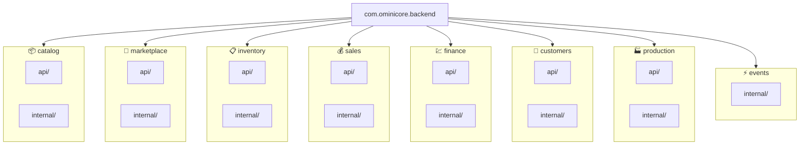
```mermaid
flowchart TB
    ROOT["com.ominicore.backend"]

    subgraph catalog["📦 catalog"]
        C_API["api/"]
        C_INT["internal/"]
    end

    subgraph marketplace["🛒 marketplace"]
        M_API["api/"]
        M_INT["internal/"]
    end

    subgraph inventory["📋 inventory"]
        I_API["api/"]
        I_INT["internal/"]
    end

    subgraph sales["💰 sales"]
        S_API["api/"]
        S_INT["internal/"]
    end

    subgraph finance["💹 finance"]
        F_API["api/"]
        F_INT["internal/"]
    end

    subgraph customers["👤 customers"]
        CU_API["api/"]
        CU_INT["internal/"]
    end

    subgraph production["🏭 production"]
        P_API["api/"]
        P_INT["internal/"]
    end

    subgraph events["⚡ events"]
        E_INT["internal/"]
    end

    ROOT --> catalog
    ROOT --> marketplace
    ROOT --> inventory
    ROOT --> sales
    ROOT --> finance
    ROOT --> customers
    ROOT --> production
    ROOT --> events
```

Cada módulo segue a convenção `api/` (controllers) + `internal/` (services, repositories, entities) + `package-info.java`.

### Dependências entre módulos

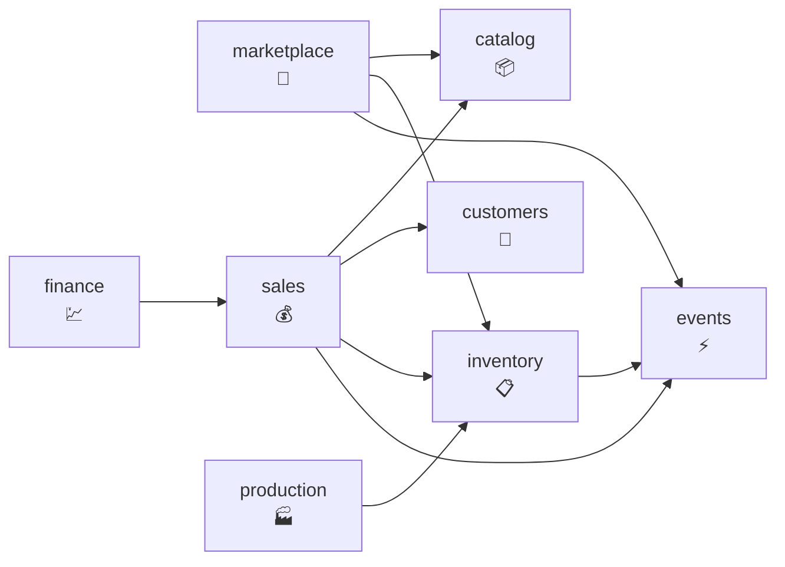
```mermaid
flowchart LR
    CAT["catalog<br/>📦"]
    MKT["marketplace<br/>🛒"]
    INV["inventory<br/>📋"]
    SAL["sales<br/>💰"]
    FIN["finance<br/>💹"]
    CUST["customers<br/>👤"]
    PROD["production<br/>🏭"]
    EVT["events<br/>⚡"]

    MKT --> CAT
    MKT --> INV
    SAL --> CAT
    SAL --> CUST
    SAL --> INV
    FIN --> SAL
    INV --> EVT
    MKT --> EVT
    SAL --> EVT
    PROD --> INV
```

---

## 4. Diagrama de arquitetura

### 4.1 Visão de contêineres

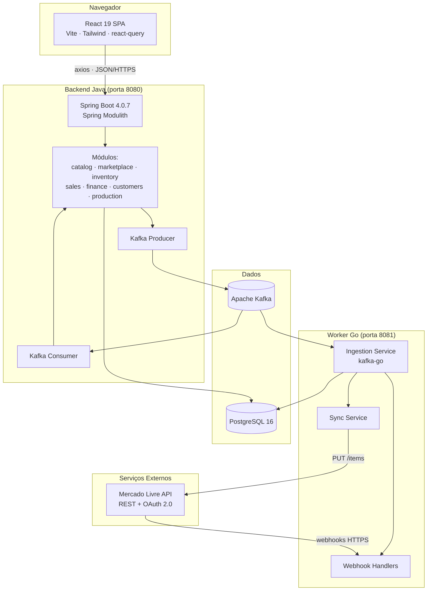
```mermaid
flowchart TB
    subgraph browser["Navegador"]
        FE["React 19 SPA<br/>Vite · Tailwind · react-query"]
    end

    subgraph backend["Backend Java (porta 8080)"]
        API["Spring Boot 4.0.7<br/>Spring Modulith"]
        MOD["Módulos:<br/>catalog · marketplace · inventory<br/>sales · finance · customers · production"]
        KAFKA_P["Kafka Producer"]
        KAFKA_C["Kafka Consumer"]
    end

    subgraph worker["Worker Go (porta 8081)"]
        GO["Ingestion Service<br/>kafka-go"]
        WH["Webhook Handlers"]
        SYNC["Sync Service"]
    end

    subgraph data["Dados"]
        PG[("PostgreSQL 16")]
        KFK[("Apache Kafka")]
    end

    subgraph ext["Serviços Externos"]
        ML["Mercado Livre API<br/>REST + OAuth 2.0"]
    end

    FE -->|"axios · JSON/HTTPS"| API
    API --> MOD
    MOD --> KAFKA_P
    KAFKA_C --> MOD
    KAFKA_P --> KFK
    KFK --> KAFKA_C
    KFK --> GO
    GO --> WH
    GO --> SYNC
    ML -->|"webhooks HTTPS"| WH
    SYNC -->|"PUT /items"| ML
    MOD --> PG
    GO --> PG
```

> Em produção, todo tráfego externo (navegador e webhooks do ML) entra pelo **Caddy** (ver [4.3](#43-ambiente-de-produção)); nenhum serviço interno é publicado diretamente.

### 4.2 Como cada componente se comunica

| Origem | Destino | Protocolo / mecanismo | Autenticação |
| ------ | ------- | --------------------- | ------------ |
| Frontend | Backend | HTTPS/JSON (axios) | JWT (futuro) |
| Backend | PostgreSQL | JDBC (Spring Data JPA) | Connection string |
| Backend | Kafka | TCP (Spring Kafka) | SASL (produção) |
| Worker Go | ML API | HTTPS/JSON | OAuth 2.0 |
| Worker Go | Kafka | TCP (kafka-go) | SASL (produção) |
| Worker Go | PostgreSQL | TCP (lib pg) | Connection string |
| ML API | Worker Go | HTTPS (webhooks, via Caddy `/webhooks/*`) | Validação da notificação (ver [10.2](#102-recebimento-de-webhook-pedido-ml)) |
| Internet | Caddy | HTTPS 443 (TLS automático) | Certificado via ACME |
| Caddy | Frontend / Backend / Worker | HTTP na rede interna `ominicore` | — |

> **Token do ML:** access token expira em horas e o refresh deve ter **um único dono** (backend *ou* worker), com o token persistido no PostgreSQL. Dois processos renovando o mesmo token podem invalidar um ao outro. Decisão a registrar em ADR próprio.
<!-- VALIDAR na doc do ML: se o refresh token é de uso único. -->

### 4.3 Ambiente de produção

Produção roda em **uma única VPS Oracle Ampere A1 (ARM64, Always Free)**, com Docker Compose (`infra/docker-compose.prod.yml`), imagens do GHCR e Caddy como único ponto de entrada. Decisões e roadmap: [ADR-0005](docs/sdd/adrs/ADR-0005-infra-cicd-docker-terraform.md).

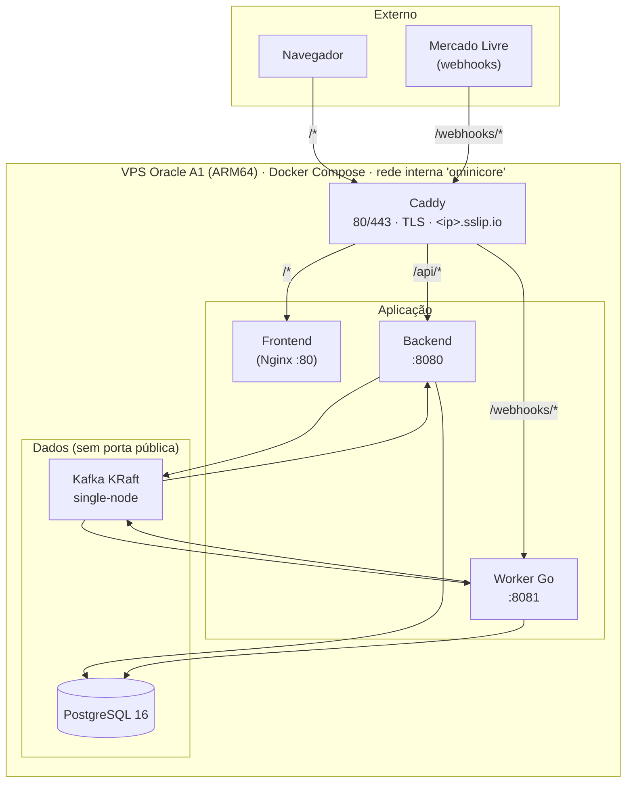
```mermaid
flowchart TB
    subgraph users["Externo"]
        U["Navegador"]
        ML_USERS["Mercado Livre<br/>(webhooks)"]
    end

    subgraph vps["VPS Oracle A1 (ARM64) · Docker Compose · rede interna 'ominicore'"]
        CADDY["Caddy<br/>80/443 · TLS · &lt;ip&gt;.sslip.io"]

        subgraph app["Aplicação"]
            FE_BE["Frontend<br/>(Nginx :80)"]
            BE["Backend<br/>:8080"]
            ING["Worker Go<br/>:8081"]
        end

        subgraph stores["Dados (sem porta pública)"]
            K["Kafka KRaft<br/>single-node"]
            PG[("PostgreSQL 16")]
        end
    end

    U -->|"/*"| CADDY
    ML_USERS -->|"/webhooks/*"| CADDY
    CADDY -->|"/*"| FE_BE
    CADDY -->|"/api/*"| BE
    CADDY -->|"/webhooks/*"| ING
    BE --> K
    ING --> K
    K --> BE
    K --> ING
    BE --> PG
    ING --> PG
```

**Roteamento no Caddy** (a ordem importa: as rotas específicas vêm antes do fallback):

| Rota | Destino | Observação |
| ---- | ------- | ---------- |
| `/webhooks/*` | `ingestion:8081` | Entrada dos webhooks do ML |
| `/api/*` | `backend:8080` | API REST. O actuator **não** é exposto |
| demais | `frontend:80` | SPA |

<!-- VALIDAR: conferir se o Caddyfile em infra/ já contém a rota /webhooks/* -->

**Limitações assumidas (projeto de estudo, orçamento zero):** um único host (sem alta disponibilidade), Kafka com replication factor 1 (perda de eventos se o volume morrer; o Postgres é a fonte da verdade e os eventos são re-sincronizáveis a partir do marketplace) e SSH temporariamente aberto (ver [17](#17-build-e-cicd)).

<details>
<summary>Evolução futura — topologia com alta disponibilidade (não implementada)</summary>

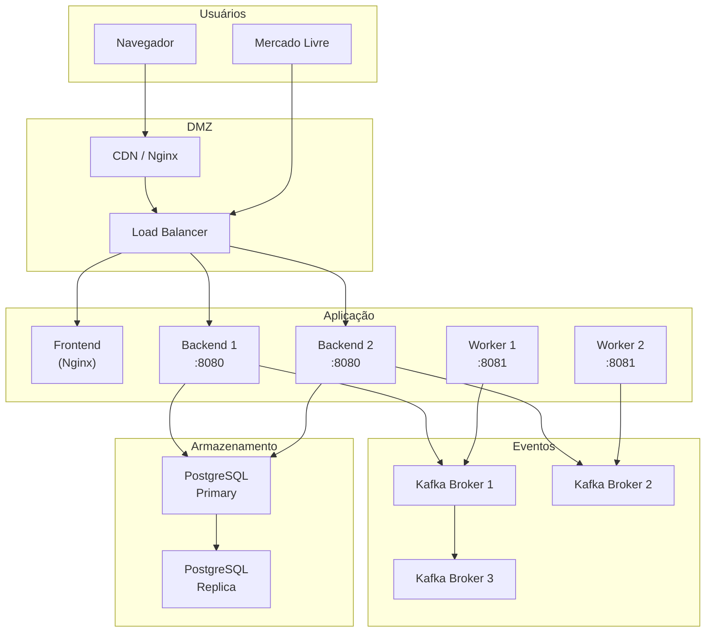
```mermaid
flowchart TB
    subgraph users["Usuários"]
        U["Navegador"]
        ML_USERS["Mercado Livre"]
    end

    subgraph dmz["DMZ"]
        LB["Load Balancer"]
        CDN["CDN / Nginx"]
    end

    subgraph app["Aplicação"]
        FE_BE["Frontend<br/>(Nginx)"]
        BE1["Backend 1<br/>:8080"]
        BE2["Backend 2<br/>:8080"]
        ING1["Worker 1<br/>:8081"]
        ING2["Worker 2<br/>:8081"]
    end

    subgraph event["Eventos"]
        K1["Kafka Broker 1"]
        K2["Kafka Broker 2"]
        K3["Kafka Broker 3"]
    end

    subgraph storage["Armazenamento"]
        PG_M["PostgreSQL<br/>Primary"]
        PG_R["PostgreSQL<br/>Replica"]
    end

    U --> CDN --> LB
    ML_USERS --> LB
    LB --> FE_BE
    LB --> BE1
    LB --> BE2
    BE1 --> K1
    BE2 --> K2
    K1 --> K3
    ING1 --> K1
    ING2 --> K2
    BE1 --> PG_M
    BE2 --> PG_M
    PG_M --> PG_R
```

</details>

---

## 5. Estrutura de pastas

### Raiz do monorepo

```
OminiCore/
├─ .github/workflows/      # backend.yml · frontend.yml · ingestion.yml · deploy.yml (F4 pendente)
├─ backend/                # API Java (Spring Boot + Modulith)
├─ frontend/               # SPA React (Vite + Tailwind)
├─ ingestion/              # Worker Go (Kafka + webhooks ML)
├─ infra/                  # Produção: docker-compose.prod.yml, Caddyfile, .env.example (Terraform na F3)
├─ docs/                   # SDD, ADRs, agents, skills, features
├─ .claude/                # Agents e skills (padrão EmpregaNet)
│   ├─ agents/             # 8 agents com frontmatter
│   └─ skills/             # 5 skills
├─ AGENTS.md               # Contexto rápido para IA
├─ harness.ps1             # Validação Windows
└─ harness.sh              # Validação Linux/macOS
```

### `backend/`

| Caminho | Responsabilidade |
| ------- | ---------------- |
| `pom.xml` | Dependências: Spring Boot 4.0.7, Modulith 2.1.0, Flyway, Kafka, Security, Sentry 8.53, OTel |
| `Dockerfile` | Imagem multi-stage (JDK 25 → JRE) |
| `docker-compose.yml` | Stack **de desenvolvimento** (Postgres, Kafka + Zookeeper, Kafdrop). Não é usado em produção |
| `src/main/java/.../catalog/` | Catálogo: CRUD de produtos, categorias, imagens |
| `src/main/java/.../catalog/api/` | Controllers REST do catálogo |
| `src/main/java/.../catalog/internal/` | Services, repositories, entities do catálogo |
| `src/main/java/.../marketplace/` | Integração ML: publicação, sync, webhooks |
| `src/main/java/.../inventory/` | Estoque: controle, alertas, ajustes, movimentações |
| `src/main/java/.../sales/` | Vendas: pedidos, status, rastreio |
| `src/main/java/.../finance/` | Financeiro: receitas, despesas |
| `src/main/java/.../customers/` | Clientes: cadastro, dados |
| `src/main/java/.../production/` | Produção: ordens, status |
| `src/main/java/.../events/` | Eventos cross-domain (Kafka producer/consumer) |
| `src/main/resources/` | Configurações, migrations Flyway |

### `frontend/src/`

| Caminho | Responsabilidade |
| ------- | ---------------- |
| `main.tsx` · `App.tsx` | Entry point e rotas |
| `features/products/` | CRUD de produtos |
| `features/marketplace/` | Integração ML (publicação, status) |
| `features/inventory/` | Gestão de estoque |
| `features/sales/` | Pedidos |
| `features/customers/` | Clientes |
| `features/dashboard/` | Dashboard de gestão |
| `components/layout/` | Layout, sidebar, header |
| `lib/` | Utilitários, helpers |

### `ingestion/`

| Caminho | Responsabilidade |
| ------- | ---------------- |
| `cmd/worker/main.go` | Entry point do worker |
| `internal/worker/worker.go` | Lógica principal do worker |
| `internal/worker/handlers.go` | Handlers de eventos/webhooks |
| `internal/config/config.go` | Configuração via environment |
| `Dockerfile` | Imagem multi-stage multi-arch (Go builder → runtime mínimo) |
<!-- VALIDAR: ADR-0005 cita distroless/scratch; confirmar a imagem final no Dockerfile -->

### `infra/`

| Caminho | Responsabilidade |
| ------- | ---------------- |
| `docker-compose.prod.yml` | Stack de produção: imagens do GHCR (`pull_policy: always`), Kafka KRaft, Postgres, Caddy. Nunca faz build |
| `Caddyfile` | Reverse proxy + TLS; roteia `/webhooks/*`, `/api/*` e o frontend |
| `.env.example` | Variáveis de produção (sem segredos) |
| `terraform/` | *(F3, pendente)* VCN, security list, compute A1 e cloud-init |

---

## 6. Tecnologias utilizadas

### Backend

| Tecnologia | Versão | Para que serve |
| ---------- | ------ | -------------- |
| Java | 25 (JDK 25) | Runtime |
| Spring Boot | 4.0.7 | Framework web |
| Spring Modulith | 2.1.0 | Modularidade (pacotes por domínio) |
| Spring Data JPA + Hibernate | (via boot) | ORM e persistência |
| Flyway | (via boot) | Migrations do banco |
| Spring Security | (via boot) | Autenticação e autorização |
| Spring Kafka | (via boot) | Producer/Consumer de eventos |
| Spring Validation | (via boot) | Validação de beans |
| Spring Actuator | (via boot) | Health checks e métricas |
| Micrometer + OTel | (via boot) | Observabilidade e tracing |
| Sentry | 8.53.0 | Captura de erros |
| PostgreSQL | 16 | Banco relacional |

### Frontend

| Tecnologia | Versão | Para que serve |
| ---------- | ------ | -------------- |
| React | 19.2.8 | Biblioteca de UI |
| TypeScript | 6.0.2 | Tipagem estática (strict) |
| Vite | 8.2.0 | Bundler e dev server |
| Tailwind CSS | 4.3.3 | Estilos utility-first |
| TanStack Query | 5.101.4 | Cache de dados do servidor |
| Axios | 1.19.0 | Cliente HTTP |
| React Hook Form | 7.85.0 | Formulários controlados |
| Zod | 4.4.3 | Validação de schemas |
| React Router | 7.18.2 | Roteamento SPA |
| react-i18next | 17.0.11 | Internacionalização |
| Recharts | 3.10.1 | Gráficos (dashboard) |
| oxlint | 1.75.0 | Linter (mais rápido que ESLint) |

### Ingestion (Go)

| Tecnologia | Versão | Para que serve |
| ---------- | ------ | -------------- |
| Go | 1.22 | Runtime |
| kafka-go | 0.4.47 | Consumer/Producer Kafka |
| PostgreSQL (lib) | — | Persistence de tokens e estado |

### Infraestrutura

| Tecnologia | Para que serve |
| ---------- | -------------- |
| PostgreSQL 16 | Banco relacional (fonte da verdade) |
| Apache Kafka (KRaft, `apache/kafka:3.8.0`) | Filas de eventos assíncronos, sem Zookeeper em produção |
| Docker + Docker Compose | Stack local (dev) e produção (`infra/`) |
| GitHub Actions | CI nativo + publicação de imagens |
| GHCR | Registry das imagens (`:latest` e `:sha-<commit>`, amd64+arm64) |
| Caddy | Reverse proxy e TLS automático |
| Terraform + HCP Terraform | *(F3)* Provisionamento da VPS; state gerenciado |
| Oracle Cloud Ampere A1 | VPS ARM64 (Always Free) |
| sslip.io | Domínio `<ip>.sslip.io` sem custo |

---

## 7. Padrões arquiteturais adotados

| Padrão | Onde está | Como é aplicado |
| ------ | --------- | --------------- |
| **Modulith** | `backend/src/` | Pacotes por domínio (`catalog/`, `marketplace/`, `inventory/`, etc.) com comunicação via eventos |
| **CQRS (leve)** | Módulos | Commands mutam; queries leem. Separação por pacote `api/` vs `internal/` |
| **Repository + Service** | `internal/` por módulo | Repositórios para acesso a dados, Services para lógica de negócio |
| **Event-driven** | `events/` + Kafka | Eventos cross-domain via Kafka (ex.: estoque mudou, produto publicado) |
| **Soft delete** | Entidades | `isDeleted` + `deletedAt` em vez de DELETE físico |
| **Feature-based (frontend)** | `frontend/src/features` | Cada feature tem seus componentes, hooks e services |
| **Atomic Design (frontend)** | `components/` | Átomos → Moléculas → Organismos |
| **Spec-Driven Development** | `docs/sdd/` | PRD → design → spec/tasks antes do código |
| **ADR** | `docs/sdd/adrs/` | Decisões estruturais documentadas |

---

## 8. Orquestração de IA e Quality Harness

O OminiCore não é apenas desenvolvido por humanos, mas por um ecossistema de agentes de IA especializados, orquestrados por um **Agent Harness** rigoroso para garantir que a automação não comprometa a qualidade.

### 8.1 Workflow de Desenvolvimento

O fluxo de trabalho é dividido entre a criação de novas funcionalidades e a manutenção do sistema:

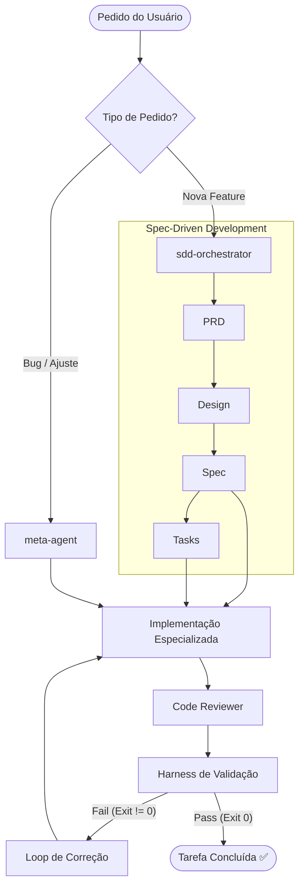
```mermaid
flowchart TD
    START([Pedido do Usuário]) --> TYPE{Tipo de Pedido?}
    
    TYPE -- "Nova Feature" --> SDD[sdd-orchestrator]
    TYPE -- "Bug / Ajuste" --> META[meta-agent]
    
    subgraph SDD_Process [Spec-Driven Development]
        SDD --> PRD[PRD] --> DES[Design] --> SPEC[Spec] --> TASK[Tasks]
    end
    
    SPEC --> IMP[Implementação Especializada]
    TASK --> IMP
    META --> IMP
    
    IMP --> REV[Code Reviewer]
    REV --> HARN[Harness de Validação]
    
    HARN -- "Fail (Exit != 0)" --> LOOP[Loop de Correção]
    LOOP --> IMP
    HARN -- "Pass (Exit 0)" --> DONE([Tarefa Concluída ✅])
```

### 8.2 Os Pilares da Orquestração

| Componente | Papel | Responsabilidade |
| :--- | :--- | :--- |
| **Meta-Agent** | Roteador | Analisa pedidos vagos e delega para o especialista correto. |
| **Specialists** | Executores | Agentes focados (`java-implementer`, `frontend-engineer`, `go-implementer`). |
| **Architect** | Guardião | Garante que a implementação respeite a arquitetura Modulith. |
| **Code Reviewer**| Auditor | Analisa diffs em busca de bugs, falhas de segurança ou RBAC. |

### 8.3 O Goal Gate (Loop de Verificação)

A regra fundamental do projeto é que **nenhuma tarefa é considerada concluída sem prova técnica**. O loop funciona assim:
1. **Implementação** $\rightarrow$ 2. **Execução do Harness** $\rightarrow$ 3. **Validação do Exit Code**.
   - Se `exit code != 0`: A IA entra em loop de análise de logs e correção automática (máx. 5 tentativas).
   - Se `exit code == 0`: A tarefa é marcada como `GOAL REACHED`.

---

## 9. Modelo de dados


### Fluxo de dados

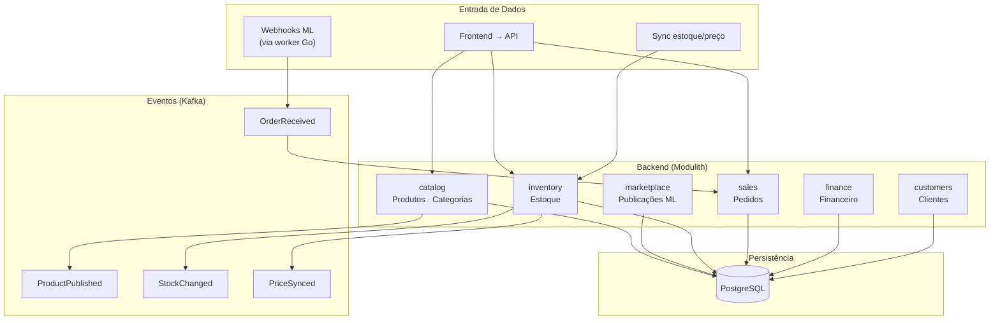
```mermaid
flowchart TB
    subgraph entrada["Entrada de Dados"]
        FE_REQ["Frontend → API"]
        ML_WH["Webhooks ML<br/>(via worker Go)"]
        ML_SYNC["Sync estoque/preço"]
    end

    subgraph backend["Backend (Modulith)"]
        CAT["catalog<br/>Produtos · Categorias"]
        MKT["marketplace<br/>Publicações ML"]
        INV["inventory<br/>Estoque"]
        SAL["sales<br/>Pedidos"]
        FIN["finance<br/>Financeiro"]
        CUST["customers<br/>Clientes"]
    end

    subgraph eventos["Eventos (Kafka)"]
        E1["ProductPublished"]
        E2["StockChanged"]
        E3["OrderReceived"]
        E4["PriceSynced"]
    end

    subgraph persist["Persistência"]
        PG[("PostgreSQL")]
    end

    FE_REQ --> CAT
    FE_REQ --> SAL
    FE_REQ --> INV
    ML_WH --> E3
    E3 --> SAL
    ML_SYNC --> INV

    CAT --> E1
    INV --> E2
    INV --> E4

    CAT --> PG
    MKT --> PG
    INV --> PG
    SAL --> PG
    FIN --> PG
    CUST --> PG
```

### Agregados principais

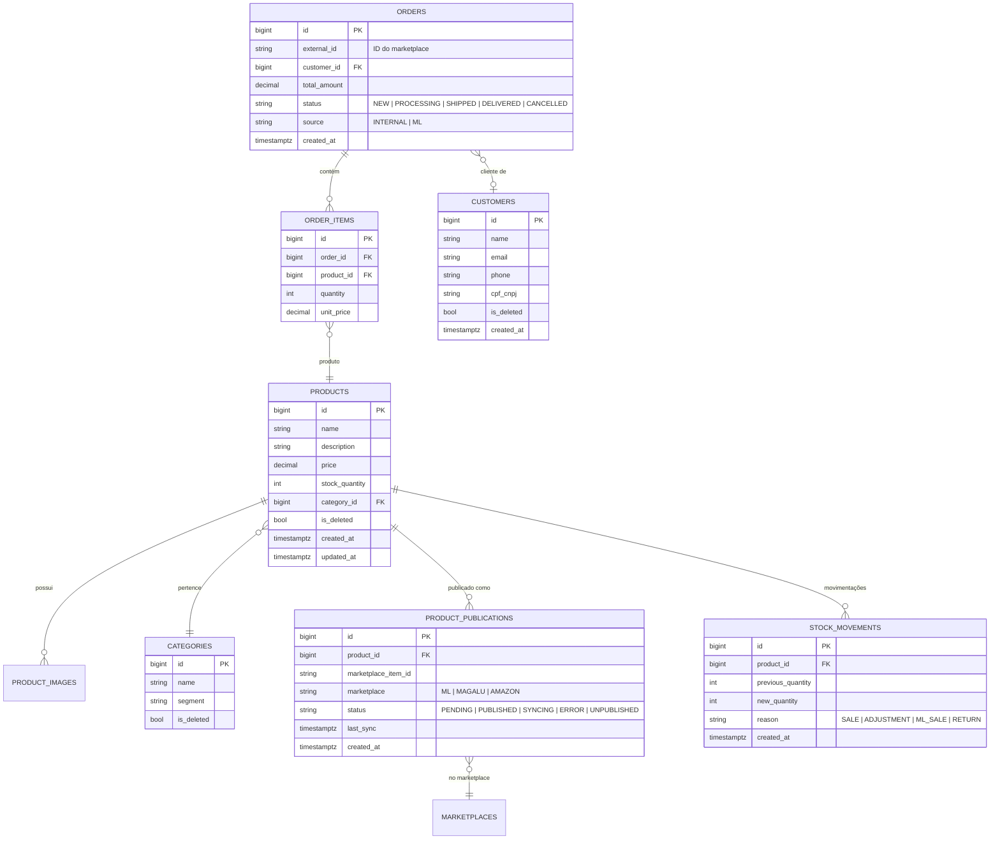
```mermaid
erDiagram
  PRODUCTS ||--o{ PRODUCT_IMAGES : "possui"
  PRODUCTS }o--|| CATEGORIES : "pertence"
  PRODUCTS ||--o{ PRODUCT_PUBLICATIONS : "publicado como"
  PRODUCTS ||--o{ STOCK_MOVEMENTS : "movimentações"
  PRODUCT_PUBLICATIONS }o--|| MARKETPLACES : "no marketplace"
  ORDERS ||--o{ ORDER_ITEMS : "contém"
  ORDER_ITEMS }o--|| PRODUCTS : "produto"
  ORDERS }o--o| CUSTOMERS : "cliente de"

  PRODUCTS {
    bigint id PK
    string name
    string description
    decimal price
    int stock_quantity
    bigint category_id FK
    bool is_deleted
    timestamptz created_at
    timestamptz updated_at
  }

  CATEGORIES {
    bigint id PK
    string name
    string segment
    bool is_deleted
  }

  PRODUCT_PUBLICATIONS {
    bigint id PK
    bigint product_id FK
    string marketplace_item_id
    string marketplace "ML | MAGALU | AMAZON"
    string status "PENDING | PUBLISHED | SYNCING | ERROR | UNPUBLISHED"
    timestamptz last_sync
    timestamptz created_at
  }

  STOCK_MOVEMENTS {
    bigint id PK
    bigint product_id FK
    int previous_quantity
    int new_quantity
    string reason "SALE | ADJUSTMENT | ML_SALE | RETURN"
    timestamptz created_at
  }

  ORDERS {
    bigint id PK
    string external_id "ID do marketplace"
    bigint customer_id FK
    decimal total_amount
    string status "NEW | PROCESSING | SHIPPED | DELIVERED | CANCELLED"
    string source "INTERNAL | ML"
    timestamptz created_at
  }

  ORDER_ITEMS {
    bigint id PK
    bigint order_id FK
    bigint product_id FK
    int quantity
    decimal unit_price
  }

  CUSTOMERS {
    bigint id PK
    string name
    string email
    string phone
    string cpf_cnpj
    bool is_deleted
    timestamptz created_at
  }
```

### Ciclo de vida do produto (publicação ML)

`DRAFT` é o produto ainda sem publicação (não há linha em `product_publications`). Os demais estados vivem em `product_publications.status`; o `marketplace_item_id` (ID do item no ML) também fica nessa tabela, não em `products`.

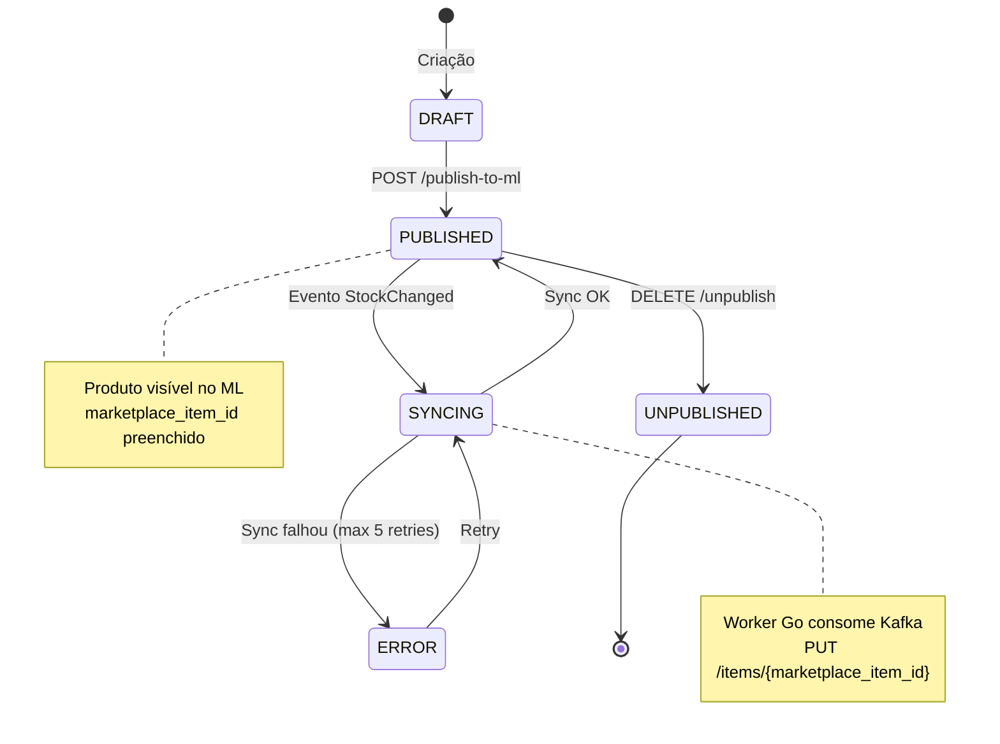
```mermaid
stateDiagram-v2
    [*] --> DRAFT : Criação
    DRAFT --> PUBLISHED : POST /publish-to-ml
    PUBLISHED --> SYNCING : Evento StockChanged
    SYNCING --> PUBLISHED : Sync OK
    SYNCING --> ERROR : Sync falhou (max 5 retries)
    ERROR --> SYNCING : Retry
    PUBLISHED --> UNPUBLISHED : DELETE /unpublish
    UNPUBLISHED --> [*]

    note right of PUBLISHED
        Produto visível no ML
        marketplace_item_id preenchido
    end note

    note right of SYNCING
        Worker Go consome Kafka
        PUT /items/{marketplace_item_id}
    end note
```

---

## 10. Fluxo de integração ML

### 10.1 Publicação de produto no ML

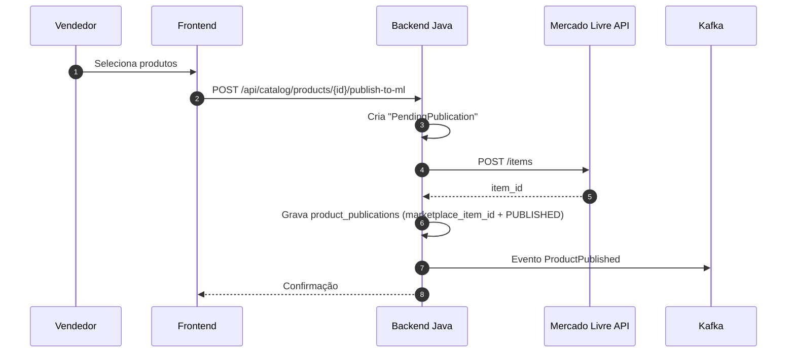
```mermaid
sequenceDiagram
    autonumber
    participant V as Vendedor
    participant FE as Frontend
    participant BE as Backend Java
    participant ML as Mercado Livre API
    participant K as Kafka

    V->>FE: Seleciona produtos
    FE->>BE: POST /api/catalog/products/{id}/publish-to-ml
    BE->>BE: Cria "PendingPublication"
    BE->>ML: POST /items
    ML-->>BE: item_id
    BE->>BE: Grava product_publications (marketplace_item_id + PUBLISHED)
    BE->>K: Evento ProductPublished
    BE-->>FE: Confirmação
```

### 10.2 Recebimento de webhook (pedido ML)

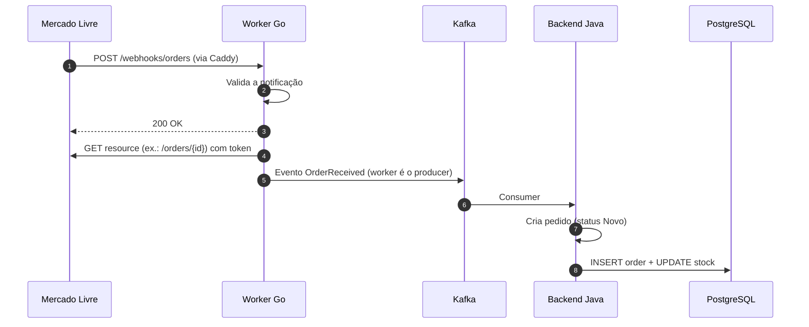
```mermaid
sequenceDiagram
    autonumber
    participant ML as Mercado Livre
    participant W as Worker Go
    participant K as Kafka
    participant BE as Backend Java
    participant DB as PostgreSQL

    ML->>W: POST /webhooks/orders (via Caddy)
    W->>W: Valida a notificação
    W-->>ML: 200 OK
    W->>ML: GET resource (ex.: /orders/{id}) com token
    W->>K: Evento OrderReceived (worker é o producer)
    K->>BE: Consumer
    BE->>BE: Cria pedido (status Novo)
    BE->>DB: INSERT order + UPDATE stock
```

<!-- VALIDAR na doc do ML: formato da notificação (normalmente traz só o `resource`), se há assinatura verificável e o prazo de resposta esperado. Ajustar "Valida a notificação" e ML_WEBHOOK_SECRET conforme confirmado. -->

**Garantias esperadas (ao implementar):**

- **Idempotência:** o ML pode reenviar a mesma notificação. O consumer deduplica por `orders.external_id` (índice único) e a chave de partição do tópico é o ID do pedido do ML.
- **Resposta rápida:** o worker só valida e publica no Kafka; o processamento pesado acontece no backend.
- **Falha no backend:** o evento fica retido no Kafka e é reprocessado quando o consumer voltar.

### 10.3 Sync de estoque

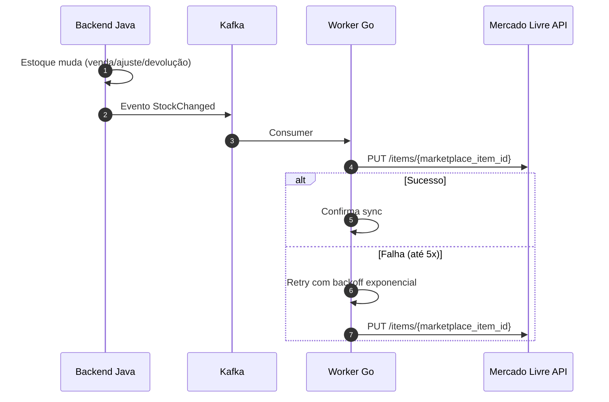
```mermaid
sequenceDiagram
    autonumber
    participant BE as Backend Java
    participant K as Kafka
    participant W as Worker Go
    participant ML as Mercado Livre API

    BE->>BE: Estoque muda (venda/ajuste/devolução)
    BE->>K: Evento StockChanged
    K->>W: Consumer
    W->>ML: PUT /items/{marketplace_item_id}
    alt Sucesso
        W->>W: Confirma sync
    else Falha (até 5x)
        W->>W: Retry com backoff exponencial
        W->>ML: PUT /items/{marketplace_item_id}
    end
```

> O `PUT` envia a quantidade **absoluta** (não um delta), então reprocessar o mesmo `StockChanged` é seguro.

### 10.4 Fluxo de dados completo

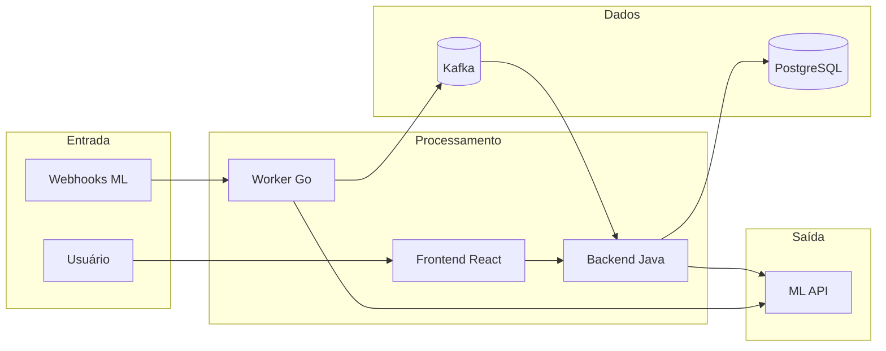
```mermaid
flowchart LR
    subgraph entrada["Entrada"]
        U["Usuário"]
        MLWH["Webhooks ML"]
    end

    subgraph processamento["Processamento"]
        FE["Frontend React"]
        BE["Backend Java"]
        W["Worker Go"]
    end

    subgraph dados["Dados"]
        PG[("PostgreSQL")]
        KFK[("Kafka")]
    end

    subgraph saida["Saída"]
        ML["ML API"]
    end

    U --> FE --> BE --> PG
    MLWH --> W --> KFK --> BE
    BE --> ML
    W --> ML
```

---

## 11. Fluxo de navegação

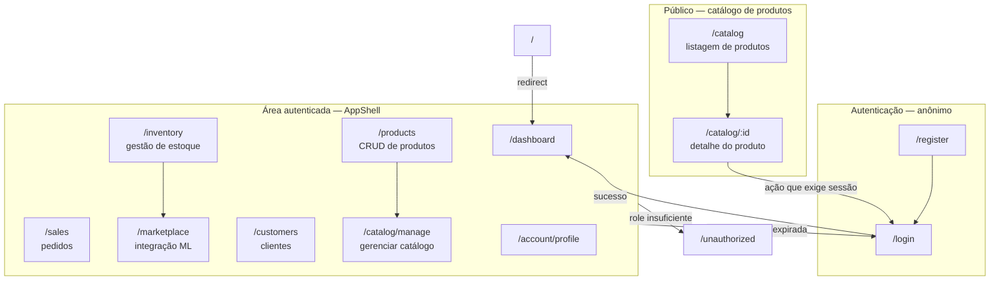
```mermaid
flowchart TD
    ROOT["/"] -->|redirect| DASH["/dashboard"]

    subgraph PUB["Público — catálogo de produtos"]
        CAT_L["/catalog<br/>listagem de produtos"]
        CAT_D["/catalog/:id<br/>detalhe do produto"]
    end

    subgraph AUTHSEG["Autenticação — anônimo"]
        LOGIN["/login"]
        REGISTER["/register"]
    end

    subgraph MAIN["Área autenticada — AppShell"]
        DASH
        PROD["/products<br/>CRUD de produtos"]
        INV["/inventory<br/>gestão de estoque"]
        SAL["/sales<br/>pedidos"]
        MKT["/marketplace<br/>integração ML"]
        CUST["/customers<br/>clientes"]
        CATA["/catalog/manage<br/>gerenciar catálogo"]
        PERFIL["/account/profile"]
    end

    NAOAUT["/unauthorized"]

    CAT_L --> CAT_D
    CAT_D -->|"ação que exige sessão"| LOGIN
    LOGIN -->|"sucesso"| DASH
    REGISTER --> LOGIN
    MAIN -->|"sessão ausente/expirada"| LOGIN
    MAIN -->|"role insuficiente"| NAOAUT
    PROD --> CATA
    INV --> MKT
```

---

## 12. Fluxo de requisições HTTP

### 12.1 Mutação autenticada (publicação de produto)

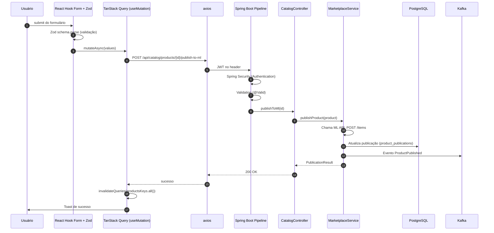
```mermaid
sequenceDiagram
    autonumber
    participant U as Usuário
    participant F as React Hook Form + Zod
    participant Q as TanStack Query (useMutation)
    participant AX as axios
    participant P as Spring Boot Pipeline
    participant C as CatalogController
    participant S as MarketplaceService
    participant DB as PostgreSQL
    participant K as Kafka

    U->>F: submit do formulário
    F->>F: Zod schema.parse (validação)
    F->>Q: mutateAsync(values)
    Q->>AX: POST /api/catalog/products/{id}/publish-to-ml
    AX->>P: JWT no header

    P->>P: Spring Security (Authentication)
    P->>P: Validation (@Valid)
    P->>C: publishToMl(id)
    C->>S: publishProduct(product)
    S->>S: Chama ML API: POST /items
    S->>DB: Atualiza publicação (product_publications)
    S->>K: Evento ProductPublished
    S-->>C: PublicationResult
    C-->>AX: 200 OK
    AX-->>Q: sucesso
    Q->>Q: invalidateQueries(productsKeys.all())
    Q->>U: Toast de sucesso
```

### 12.2 Leitura pública (catálogo de produtos)

O frontend é uma **SPA (Vite + React Router)**: o HTML é estático e os dados vêm da API no navegador, via TanStack Query.

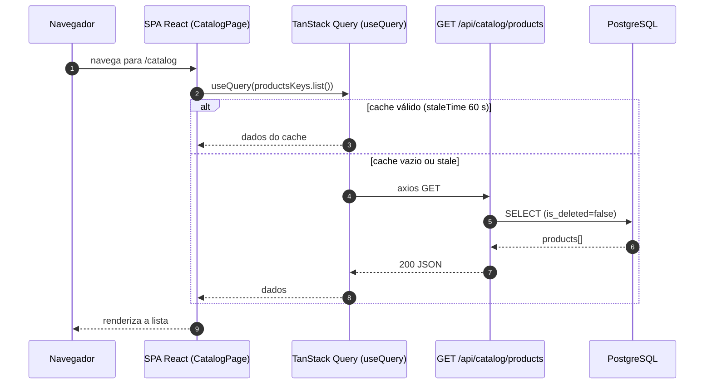
```mermaid
sequenceDiagram
    autonumber
    participant U as Navegador
    participant SPA as SPA React (CatalogPage)
    participant Q as TanStack Query (useQuery)
    participant API as GET /api/catalog/products
    participant DB as PostgreSQL

    U->>SPA: navega para /catalog
    SPA->>Q: useQuery(productsKeys.list())
    alt cache válido (staleTime 60 s)
        Q-->>SPA: dados do cache
    else cache vazio ou stale
        Q->>API: axios GET
        API->>DB: SELECT (is_deleted=false)
        DB-->>API: products[]
        API-->>Q: 200 JSON
        Q-->>SPA: dados
    end
    SPA-->>U: renderiza a lista
```

---

## 13. Gerenciamento de estado

### Árvore de providers

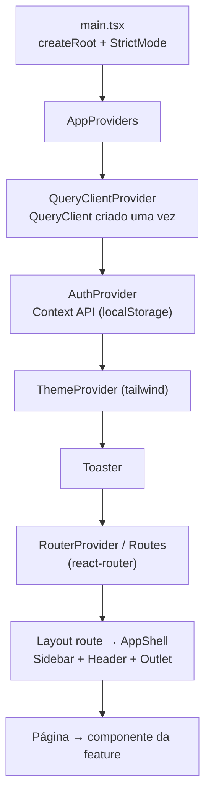
```mermaid
flowchart TB
    A["main.tsx<br/>createRoot + StrictMode"] --> B["AppProviders"]
    B --> C["QueryClientProvider<br/>QueryClient criado uma vez"]
    C --> D["AuthProvider<br/>Context API (localStorage)"]
    D --> E["ThemeProvider (tailwind)"]
    E --> F["Toaster"]
    F --> G["RouterProvider / Routes<br/>(react-router)"]
    G --> H["Layout route → AppShell<br/>Sidebar + Header + Outlet"]
    H --> J["Página → componente da feature"]
```

<!-- VALIDAR: conferir a ordem real dos providers em main.tsx/App.tsx -->

### Hierarquia de estado

| Camada | Onde vive | Responsabilidade |
| ------ | --------- | ---------------- |
| **Server State** | TanStack Query | Cache de dados da API, mutations, invalidação |
| **Global State** | Context API | Auth, tema, config global |
| **Form State** | React Hook Form + Zod | Formulários controlados com validação |
| **Navigation State** | react-router-dom | Rota atual, parâmetros |
| **Local State** | useState / useReducer | UI local de componentes |

---

## 14. Estratégia de cache e eventos

### Camadas de cache

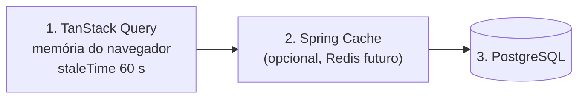
```mermaid
flowchart LR
    BROWSER["1. TanStack Query<br/>memória do navegador<br/>staleTime 60 s"]
    API_CACHE["2. Spring Cache<br/>(opcional, Redis futuro)"]
    DB[("3. PostgreSQL")]

    BROWSER --> API_CACHE
    API_CACHE --> DB
```

### Fluxo de eventos (Kafka)

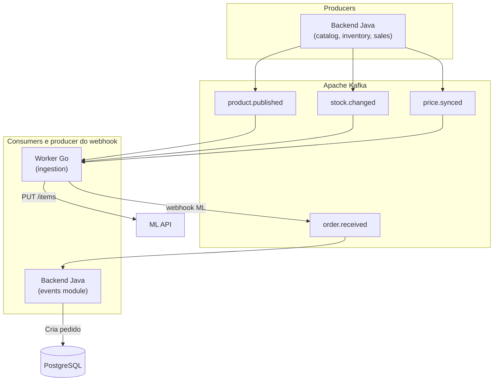
```mermaid
flowchart TB
    subgraph producers["Producers"]
        BE["Backend Java<br/>(catalog, inventory, sales)"]
    end

    subgraph kafka["Apache Kafka"]
        TOPIC1["product.published"]
        TOPIC2["stock.changed"]
        TOPIC3["order.received"]
        TOPIC4["price.synced"]
    end

    subgraph consumers["Consumers e producer do webhook"]
        W["Worker Go<br/>(ingestion)"]
        BE_C["Backend Java<br/>(events module)"]
    end

    BE --> TOPIC1
    BE --> TOPIC2
    W -->|"webhook ML"| TOPIC3
    BE --> TOPIC4

    TOPIC1 --> W
    TOPIC2 --> W
    TOPIC3 --> BE_C
    TOPIC4 --> W

    W -->|"PUT /items"| ML["ML API"]
    BE_C -->|"Cria pedido"| DB[("PostgreSQL")]
```

| Tópico | Producer | Consumer | Chave de partição |
| ------ | -------- | -------- | ----------------- |
| `product.published` | Backend | Worker | `product_id` |
| `stock.changed` | Backend | Worker | `product_id` (mantém a ordem por produto) |
| `order.received` | **Worker** (webhook do ML) | Backend | ID do pedido no ML |
| `price.synced` | Backend | Worker | `product_id` |

> Hoje os tópicos são criados automaticamente (`auto.create.topics=true`, ADR-0005). Evolução recomendada: criar os tópicos de forma explícita (partições e retenção) e adicionar tópicos DLQ para mensagens que esgotarem os 5 retries.

---

## 15. Tratamento de erros

### Contrato de erro — formato padronizado

Todas as respostas de erro da API têm a mesma forma:

```json
{
  "statusCode": 400,
  "code": "VALIDATION_ERROR",
  "message": "Dados inválidos",
  "details": ["Nome é obrigatório", "Preço deve ser > 0"]
}
```

### Tratamento no frontend

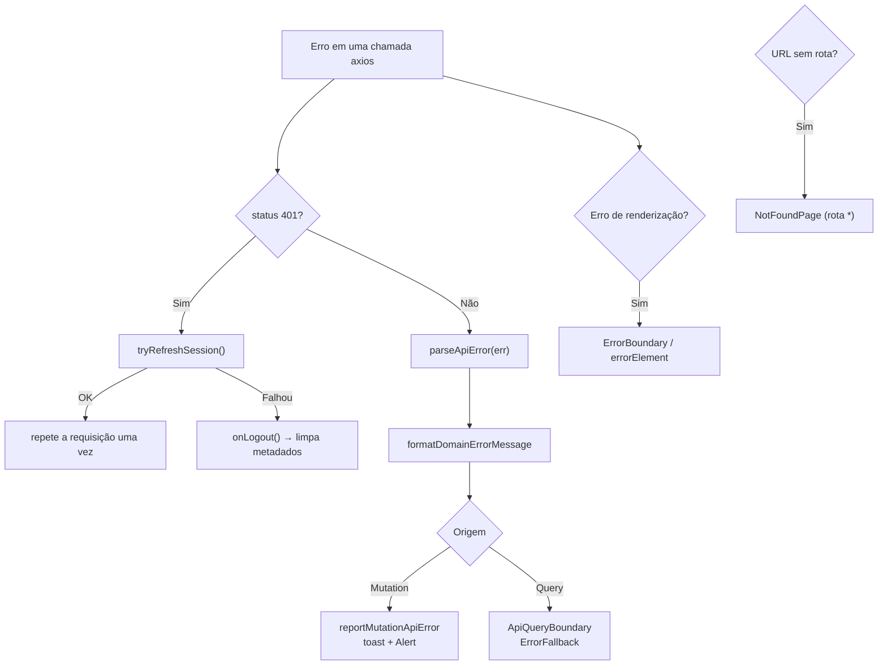
```mermaid
flowchart TB
    ERR["Erro em uma chamada axios"] --> IS401{"status 401?"}
    IS401 -->|Sim| REFRESH["tryRefreshSession()"]
    REFRESH -->|OK| RETRY["repete a requisição uma vez"]
    REFRESH -->|Falhou| LOGOUT["onLogout() → limpa metadados"]
    IS401 -->|Não| PARSE["parseApiError(err)"]
    PARSE --> MSG["formatDomainErrorMessage"]
    MSG --> MUT{"Origem"}
    MUT -->|Mutation| REPORT["reportMutationApiError<br/>toast + Alert"]
    MUT -->|Query| BOUND["ApiQueryBoundary<br/>ErrorFallback"]
    ERR --> RENDER{"Erro de renderização?"}
    RENDER -->|Sim| BOUNDARY["ErrorBoundary / errorElement"]
    ROUTE{"URL sem rota?"} -->|Sim| NF["NotFoundPage (rota *)"]
```

---

## 16. Configurando o ambiente

### Pré-requisitos

| Ferramenta | Versão | Necessário para |
| ---------- | ------ | --------------- |
| JDK | 25+ | Backend |
| Node.js | 20+ | Frontend |
| Go | 1.22+ | Ingestion |
| Docker + Docker Compose | recente | Stack local |
| Maven | (wrapper incluso) | Backend build |

### Passo a passo

**1. Clonar**

```bash
git clone <url-do-repositorio> && cd OminiCore
```

**2. Subir infraestrutura (stack de desenvolvimento)**

```bash
docker compose -f backend/docker-compose.yml up -d postgres kafka
```

<!-- VALIDAR: nomes dos serviços em backend/docker-compose.yml (o Kafka de dev depende do Zookeeper) -->

**3. Backend**

```bash
cd backend
.\mvnw.cmd spring-boot:run   # Windows
./mvnw spring-boot:run       # Linux/macOS
```

**4. Frontend**

```bash
cd frontend
npm install
npm run dev
```

**5. Ingestion (opcional)**

```bash
cd ingestion
go run ./cmd/worker
```

### Portas

| Serviço | Porta |
| ------- | ----- |
| Frontend (Vite) | 5173 |
| Backend (API) | 8080 |
| PostgreSQL | 5432 |
| Kafka | 9092 |
| Worker Go | 8081 |
| Kafdrop (dev) | 9000 |

> As portas acima valem para **desenvolvimento**. Em produção só `80` e `443` (Caddy) são públicas; `5432`, `9092`, `8080` e `8081` ficam na rede interna `ominicore`.
<!-- VALIDAR: porta do Kafdrop e do Zookeeper no compose de dev -->

### Variáveis de ambiente

**Backend** (`application.properties` ou env vars):

| Variável | Default | Descrição |
|----------|---------|-----------|
| `spring.datasource.url` | `jdbc:postgresql://localhost:5432/ominicore` | URL do banco |
| `spring.datasource.username` | `ominicore` | Usuário do banco |
| `spring.datasource.password` | `ominicore` | Senha do banco |
| `spring.kafka.bootstrap-servers` | `localhost:9092` | Kafka brokers |
| `SENTRY_DSN` | (vazio) | DSN do Sentry |
| `SENTRY_ENV` | `dev` | Ambiente |

**Ingestion** (env vars):

| Variável | Descrição |
|----------|-----------|
| `KAFKA_BROKERS` | Endereço do Kafka |
| `ML_WEBHOOK_SECRET` | Secret para validação de webhooks |
| `KAFKA_GROUP_ID` | Consumer group do worker (produção: `ml-ingestion`) |
| `ML_ACCESS_TOKEN` | Token inicial de acesso à API do ML. Em runtime o token deve viver no PostgreSQL, com um único dono do refresh (ver [4.2](#42-como-cada-componente-se-comunica)) |
| `DATABASE_URL` | Connection string do PostgreSQL |

**Produção** (`infra/.env`, a partir de `infra/.env.example`; nunca commitar):

| Variável | Descrição |
|----------|-----------|
| `KAFKA_BROKERS` / `KAFKA_GROUP_ID` | Kafka interno e consumer group do worker |
| `JPA_DDL_AUTO` | Hoje `create` (**zera o schema a cada restart do backend**). Trocar para `validate` quando as migrations existirem |
| `FLYWAY_ENABLED` | Hoje desligado; ligar junto com `JPA_DDL_AUTO=validate` |
| `BACKEND_TAG` · `INGESTION_TAG` · `FRONTEND_TAG` | *(planejado, F4)* Tag da imagem por serviço, para rollback independente. Padrão: `latest` |

<!-- VALIDAR: nomes exatos das variáveis em infra/.env.example -->

---

## 17. Executando o projeto

### Opção A — Docker Compose (stack de desenvolvimento)

```bash
docker compose -f backend/docker-compose.yml up --build
```

### Opção B — Desenvolvimento local (recomendado)

Terminal 1 — Infra:
```bash
docker compose -f backend/docker-compose.yml up -d postgres kafka
```

Terminal 2 — Backend:
```bash
cd backend && ./mvnw spring-boot:run
```

Terminal 3 — Frontend:
```bash
cd frontend && npm run dev
```

Terminal 4 — Ingestion:
```bash
cd ingestion && go run ./cmd/worker
```

Acesse: `http://localhost:5173`

### Opção C — Produção

Produção **não** é operada manualmente: o CI publica as imagens no GHCR e a VPS apenas as baixa (`docker compose -f infra/docker-compose.prod.yml pull && up -d`). O deploy automatizado é a fase F4 (ver [17](#17-build-e-cicd)).

---

## 18. Build e CI/CD

### Pipeline de build

Cada módulo tem seu próprio workflow com CI nativo + publicação de imagem Docker:

```mermaid
flowchart LR
    PUSH["push / pull_request"] --> W

    subgraph W["backend.yml · frontend.yml · ingestion.yml"]
        T["job de teste nativo<br/>mvnw test / npm lint+build / go test"] --> IMG["job image<br/>somente push em main<br/>buildx amd64+arm64"]
    end

    IMG --> GHCR["GHCR<br/>ghcr.io/&lt;owner&gt;/ominicore-*:latest + :sha-&lt;commit&gt;"]

    DISPATCH["workflow_dispatch manual"] --> DEPLOY["deploy.yml<br/>legado desativado — reescrita na F4 (ADR-0005)"]
```

| Workflow | Gatilho | O que faz |
| -------- | ------- | --------- |
| `backend.yml` | push/PR em `backend/**` | Testes Maven nativos; em `main`, publica `ominicore-backend` no GHCR |
| `frontend.yml` | push/PR em `frontend/**` | Lint + build nativos; em `main`, publica `ominicore-frontend` no GHCR |
| `ingestion.yml` | push/PR em `ingestion/**` | Build + testes Go; em `main`, publica `ominicore-ingestion` no GHCR |
| `deploy.yml` | apenas `workflow_dispatch` | Deploy legado desativado; será reescrito na F4 — ver [ADR-0005](docs/sdd/adrs/ADR-0005-infra-cicd-docker-terraform.md) |

> O workflow `harness.yml` foi aposentado na F2 (redundante com os 3 workflows por módulo); o harness **local** (`harness.ps1`/`harness.sh`) permanece. Stack de produção: `infra/docker-compose.prod.yml` (ver ADR-0005).

### Fluxo de Deployment e Infraestrutura de Produção

O OminiCore adota a filosofia de **build imutável**: o código é testado e empacotado em imagens Docker no CI, garantindo que a mesma imagem validada no pipeline seja a que roda em produção.

#### Fluxo de CI/CD (End-to-End)

```mermaid
flowchart LR
    DEV["💻 Desenvolvedor"] -->|Push main| GHA["⚙️ GitHub Actions"]
    
    subgraph GHA_PIPELINE["Pipeline de CI"]
        T["🧪 Testes Nativos<br/>(Maven/npm/Go)"] --> B["🐳 Docker Buildx<br/>(amd64 + arm64)"]
    end
    
    GHA --> T
    B --> GHCR["📦 GHCR<br/>(Registry)"]
    
    GHCR -->|Pull Image| VPS["☁️ VPS Oracle ARM64"]
    
    subgraph PROD_SERVER["Servidor de Produção"]
        Caddy["🌐 Caddy<br/>(Reverse Proxy + TLS)"]
        Compose["🐳 Docker Compose<br/>(Orchestrator)"]
        Apps["🚀 Containers<br/>(BE, FE, Worker)"]
        Data["💾 Data Store<br/>(Postgres, Kafka)"]
        
        Caddy --> Compose
        Compose --> Apps
        Apps --> Data
    end
    
    GHA -.->|"SSH Deploy (F4, pendente)"| Compose
    Compose -->|docker compose pull| GHCR
```


# Fluxo de Infraestrutura e CI/CD - OminiCore

```mermaid
flowchart TD
    Start([Repo Push]) --> GHA{GitHub Actions}

    subgraph GHA_Block [GitHub Actions]
        GHA --> APP_Flow
        GHA --> INFRA_Flow

        subgraph APP_Flow [Caminho APP]
            CI[CI Testes] --> Build[Build Multi-arch]
            Build --> PushGHCR[Push GHCR]
            PushGHCR --> Deploy[Deploy via SSH/Runner Compose Pull]
            Deploy --> Smoke[Smoke Tests]
        end

        subgraph INFRA_Flow [Caminho INFRA]
            TFPlan[Terraform Plan] --> TFApply[Terraform Apply]
            TFApply --> TFState[Update State HCP]
        end
    end

    PushGHCR --> GHCR[(GHCR Images :latest / :sha)]

    subgraph VPS [VPS Oracle Prod]
        Caddy[Caddy Proxy 80/443]
        
        subgraph InternalNet [Rede Interna omnicore]
            subgraph AppsGroup [Grupo APPS]
                Backend[Backend]
                Frontend[Frontend]
                Ingestion[Ingestion]
            end
            
            subgraph InfraGroup [Grupo INFRA]
                Postgres[(Postgres)]
                Kafka[(Kafka)]
            end
        end
        Caddy --> AppsGroup
        Caddy --> InfraGroup
    end

    User([Usuário]) -->|HTTPS| Caddy
```

#### Composição da Infraestrutura

A infraestrutura de produção é desenhada para custo zero (Oracle Always Free) e máxima simplicidade operacional:

1.  **Compute**: VPS Oracle Cloud **Ampere A1 (ARM64)**, provisionada via **Terraform** com state gerenciado no **HCP Terraform**.
2.  **Edge & Segurança**:
    *   **Caddy**: Atua como reverse proxy único. Gerencia automaticamente certificados TLS via **sslip.io** (DNS dinâmico baseado no IP).
    *   **Isolamento**: Apenas as portas `80` e `443` são expostas. Todos os demais serviços (`backend`, `postgres`, `kafka`, `ingestion`) residem em uma rede Docker interna isolada (`ominicore`).
3.  **Runtime**:
    *   **Docker Compose**: Orquestra a stack de produção definida em `infra/docker-compose.prod.yml`.
    *   **Imagens**: Consumidas do **GHCR (GitHub Container Registry)** com `pull_policy: always`, evitando builds dentro do servidor de produção.
4.  **Persistência & Mensageria**:
    *   **PostgreSQL 16**: Fonte da verdade para todos os módulos.
    *   **Apache Kafka (KRaft)**: Operando em modo *single-node* para comunicação assíncrona entre backend e worker de ingestão.


#### Roadmap e dívidas técnicas (ADR-0005)

| Fase | Escopo | Status |
| ---- | ------ | ------ |
| F1 | Dockerfiles multi-arch, compose de produção, Caddyfile, `.env.example` | Concluída |
| F2 | CI por módulo com job `image` e GHCR multi-arch | Concluída |
| F3 | Terraform OCI (VCN, security list, compute A1, cloud-init) com state no HCP Terraform | Pendente |
| F4 | `deploy.yml`: deploy via Actions sem build na VPS | Pendente |
| F5 | TLS + `<ip>.sslip.io` + hardening (SSH, UFW, atualizações automáticas) | Pendente |

| Dívida / risco | Situação | Encaminhamento |
| -------------- | -------- | -------------- |
| SSH (22) aberto a `0.0.0.0/0` | Risco aceito (IP dinâmico). Acesso só por chave | Resolver na F5. Atenção: o deploy da F4 também precisa entrar por SSH, então decidir junto (whitelist, Tailscale ou deploy por *pull*) |
| `ddl-auto=create` em produção | Cada restart do backend recria o schema | Criar `V1__baseline.sql`, ligar Flyway e usar `validate` |
| Kafka com RF=1 e limite de 768M | Perda de eventos se o volume morrer; heap padrão pode estourar o limite | Definir `KAFKA_HEAP_OPTS` (ex.: `-Xms512m -Xmx512m`) ou subir o limite |
| IP público da VM | Se a VM for recriada, o IP e o `<ip>.sslip.io` mudam | IP reservado no Terraform (F3) |
| Tag única no deploy | Os workflows têm path filter: nem todo commit gera `:sha-<commit>` dos três serviços | Tag por serviço (`*_TAG`) na F4 |
| Reclaim da VM Always Free | A Oracle pode recolher instâncias ociosas | Recriar com `terraform apply` + `compose pull/up`; conferir a política atual da Oracle |

**Rollback (após a F4):** apontar o serviço afetado para a tag anterior, por exemplo `BACKEND_TAG=sha-<commit-anterior>`, e rodar `docker compose up -d`. Não há rebuild.

### Harness de validação

```bash
.\harness.ps1                # Windows (todos)
.\harness.ps1 backend        # Só backend
.\harness.ps1 frontend       # Só frontend
.\harness.ps1 ingestion      # Só ingestion
```

### Build local

Backend:
```bash
cd backend && ./mvnw clean package -DskipTests
```

Frontend:
```bash
cd frontend && npm run build
```

Ingestion:
```bash
cd ingestion && go build -o worker ./cmd/worker
```

---

## 19. Convenções do projeto

### Gerais

| Tema | Convenção |
| ---- | --------- |
| Idioma | Documentação em **pt-BR**; código em **inglês** |
| Commits | Conventional Commits: `feat:`, `fix:`, `refactor:`, `docs:`, `perf:` |
| Branch principal | `main` |
| Segredos | **Nunca** no repo. Usar env vars ou Docker Compose `.env` |

### Backend (Java/Spring)

| Tema | Convenção |
| ---- | --------- |
| Modularidade | Pacotes por domínio: `catalog/`, `marketplace/`, `inventory/`, etc. |
| Estrutura do módulo | `<modulo>/api/` (controllers) + `<modulo>/internal/` (services, repos, entities) |
| Nomenclatura | `PascalCase` para classes; `_camelCase` para campos privados |
| Sufixos | `*Controller`, `*Service`, `*Repository`, `*Entity`, `*Exception` |
| Migrations | Flyway, em `src/main/resources/db/migration/` |
| Validação | Bean Validation (annotations) + `@Valid` nos controllers |
| Eventos | Kafka via Spring Kafka; producer e consumer por módulo |
| Transações | `@Transactional` em services; eventos publicados após commit |

### Frontend (React/TypeScript)

| Tema | Convenção |
| ---- | --------- |
| Arquivos | `kebab-case` para módulos; `PascalCase` para componentes |
| Pastas | `kebab-case`; features em `src/features/` |
| Componentes | Um por arquivo, exportado nomeado |
| Tipos | `strict: true`, **`any` proibido** |
| Estilos | Tailwind CSS (utility-first) |
| Forms | React Hook Form + Zod |
| State do servidor | TanStack Query (react-query) |
| Linter | oxlint |

### Ingestion (Go)

| Tema | Convenção |
| ---- | --------- |
| Estrutura | `cmd/worker/` (entry point) + `internal/worker/` (lógica) + `internal/config/` |
| Handlers | Um handler por tipo de evento/webhook |
| Erros | Tratamento com retry + backoff exponencial |
| Config | Via environment variables |

---

## Docs

| Documento | Caminho | Quando usar |
| --------- | ------- |-------------|
| Guia de agents | `AGENTS.md` | Contexto rápido para IA |
| Workflow dos agents | `docs/agents/README.md` | Pipeline de execução |
| SDD Orchestrator | `docs/sdd/SDD-ORCHESTRATOR.md` | Nova feature (PRD → spec) |
| ADRs | `docs/sdd/adrs/README.md` | Decisões arquiteturais |
| ADR-0003 | `docs/sdd/adrs/` | Ingestão em Go com Kafka (worker separado) |
| ADR-0005 | `docs/sdd/adrs/ADR-0005-infra-cicd-docker-terraform.md` | CI/CD, GHCR, Terraform e VPS Oracle (roadmap F1–F5) |
| Feature ML | `docs/features/ml-integration/` | Integração Mercado Livre |
| Feature Dashboard | `docs/features/dashboard/` | Dashboard de gestão |
| Skills | `docs/skills/README.md` | Conhecimento especializado |