# SG-MULTIDIA

> Sistema de gestão leve e rápido para **publicação de produtos no Mercado Livre e gestão de catálogo multi-produto**, com integração nativa ao ML.
> Monorepo com API Java (Spring Boot 4 + Modulith), worker Go (ingestão) e frontend React (Vite + Tailwind).


---

## Índice

1. [Visão geral](#1-visão-geral)
2. [Principais funcionalidades](#2-principais-funcionalidades)
3. [Arquitetura da solução](#3-arquitetura-da-solução)
4. [Diagrama de arquitetura](#4-diagrama-de-arquitetura)
5. [Estrutura de pastas](#5-estrutura-de-pastas)
6. [Tecnologias utilizadas](#6-tecnologias-utilizadas)
7. [Padrões arquiteturais adotados](#7-padrões-arquiteturais-adotados)
8. [Modelo de dados](#8-modelo-de-dados)
9. [Fluxo de integração ML](#9-fluxo-de-integração-ml)
10. [Fluxo de navegação](#10-fluxo-de-navegação)
11. [Fluxo de requisições HTTP](#11-fluxo-de-requisições-http)
12. [Gerenciamento de estado](#12-gerenciamento-de-estado)
13. [Estratégia de cache e eventos](#13-estratégia-de-cache-e-eventos)
14. [Tratamento de erros](#14-tratamento-de-erros)
15. [Configurando o ambiente](#15-configurando-o-ambiente)
16. [Executando o projeto](#16-executando-o-projeto)
17. [Build e CI/CD](#17-build-e-cicd)
18. [Convenções do projeto](#18-convenções-do-projeto)

---

## 1. Visão geral

### Objetivo de negócio

O SG-MULTIDIA é um ERP leve focado em **publicar e gerenciar produtos no Mercado Livre** (catálogo multi-produto, multi-segmento — ex.: multimídia, comunicação visual, impressão), com integração nativa ao ML. O MVP combina publicação automatizada de produtos, sync de estoque/preço via Kafka e um dashboard de gestão.

### Problemas que resolve

| Problema | Como o sistema resolve |
| -------- | ---------------------- |
| Publicar produtos no ML é manual, um a um | Publicação em lote via API do ML, com status de cada item |
| Estoque e preço ficam desatualizados no ML | Sync automático via worker Go + Kafka (< 5 min) |
| Pedidos do ML chegam por e-mail e precisam ser digitados | Webhooks do ML → worker → Kafka → backend cria pedido automaticamente |
| Não há visão centralizada do negócio | Dashboard com KPIs: vendas, estoque baixo, pedidos pendentes, resumo ML |
| Catálogo de produtos sem gestão | CRUD de catálogo com categorias, preços, estoque e multi-segmento |

### Personas

| Persona | O que faz |
| ------- | --------- |
| Vendedor/Lojista | Publica produtos no ML, gerencia catálogo, acompanha pedidos |
| Gestor | Vê dashboard com KPIs, toma decisões rápidas |
| Operador | Gerencia estoque, preços e integrações |

---

## 2. Principais funcionalidades

### MVP — Integração Mercado Livre
- Publicação de produtos no ML (individual e em lote)
- Sync automático de estoque (< 5 min)
- Sync automático de preço (< 5 min)
- Recebimento de pedidos via webhooks
- Dashboard de resumo ML (produtos publicados, vendas, erros)

### MVP — Dashboard
- Cards de KPI (vendas do dia, receita, estoque baixo, pedidos pendentes)
- Gráfico de vendas (7d / 30d / 90d) com comparativo
- Alertas de estoque baixo
- Lista de pedidos recentes
- Widget de resumo ML

### Catálogo de produtos
- CRUD de produtos com categorias, preços, estoque
- Multi-segmento (multimídia, comunicação visual, impressão, etc.)
- Imagens por produto
- Status de publicação ML por produto

### Gestão de estoque
- Controle de estoque por produto
- Alertas de estoque baixo
- Ajustes manuais e automáticos (via sync ML)
- Histórico de movimentações (SALE, ADJUSTMENT, ML_SALE, RETURN)

### Gestão de pedidos
- Pedidos internos e do ML em lista única
- Status do pedido (Novo, Processando, Enviado, Entregue, Cancelado)
- Detalhe do pedido com itens, valores e rastreio

---

## 3. Arquitetura da solução

O repositório é um **monorepo** com três aplicações independentes e uma pasta de documentação (`docs/`).

| Aplicação | Stack | Papel |
| --------- | ----- | ----- |
| `backend/` | Java 21 + Spring Boot 4.0.7 + Modulith (Maven) | API REST — domínio, casos de uso, persistência, integração ML |
| `ingestion/` | Go 1.22 + kafka-go | Worker — webhooks ML, sync estoque/preço, consumer Kafka |
| `frontend/` | React 19 + TypeScript 6 + Vite 8 + Tailwind v4 | SPA — catálogo, dashboard, gestão |

### Módulos do backend (Spring Modulith)

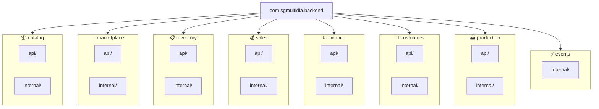

Cada módulo segue a convenção `api/` (controllers) + `internal/` (services, repositories, entities) + `package-info.java`.

### Dependências entre módulos

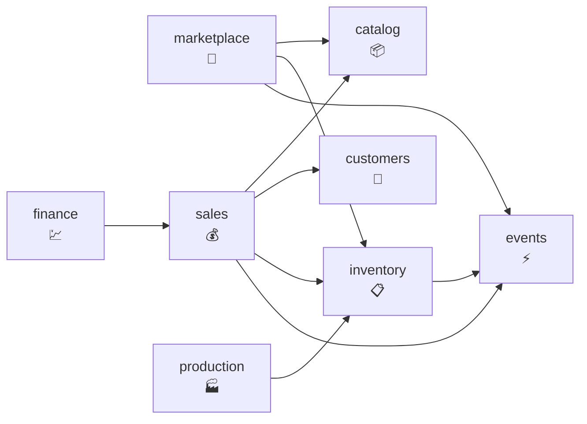

---

## 4. Diagrama de arquitetura

### 4.1 Visão de contêineres

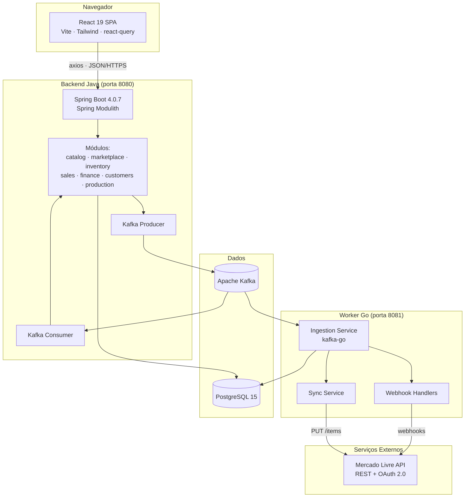

### 4.2 Como cada componente se comunica

| Origem | Destino | Protocolo / mecanismo | Autenticação |
| ------ | ------- | --------------------- | ------------ |
| Frontend | Backend | HTTPS/JSON (axios) | JWT (futuro) |
| Backend | PostgreSQL | JDBC (Spring Data JPA) | Connection string |
| Backend | Kafka | TCP (Spring Kafka) | SASL (produção) |
| Worker Go | ML API | HTTPS/JSON | OAuth 2.0 |
| Worker Go | Kafka | TCP (kafka-go) | SASL (produção) |
| Worker Go | PostgreSQL | TCP (lib pg) | Connection string |
| ML API | Worker Go | HTTPS (webhooks) | Assinatura HMAC |

### 4.3 Ambiente de produção

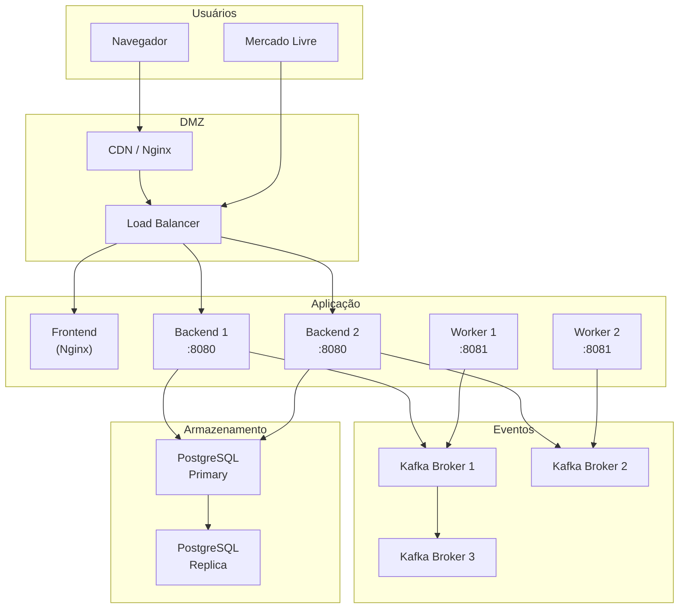

---

## 5. Estrutura de pastas

### Raiz do monorepo

```
SG-MULTIDIA/
├─ .github/workflows/      # CI/CD: build+testes, Docker build, deploy
├─ backend/                # API Java (Spring Boot + Modulith)
├─ frontend/               # SPA React (Vite + Tailwind)
├─ ingestion/              # Worker Go (Kafka + webhooks ML)
├─ docs/                   # SDD, ADRs, agents, skills, features
├─ .claude/                # Agents e skills (padrão EmpregaNet)
│   ├─ agents/             # 8 agents com frontmatter
│   └─ skills/             # 5 skills
├─ CLAUDE.md               # Contexto rápido para IA
├─ harness.ps1             # Validação Windows
└─ harness.sh              # Validação Linux/macOS
```

### `backend/`

| Caminho | Responsabilidade |
| ------- | ---------------- |
| `pom.xml` | Dependências: Spring Boot 4.0.7, Modulith 2.1.0, Flyway, Kafka, Security, Sentry 8.53, OTel |
| `Dockerfile` | Imagem multi-stage (JDK 25 → JRE) |
| `docker-compose.yml` | Postgres, Kafka, API |
| `src/main/java/.../catalog/` | Catálogo: CRUD de produtos, categorias, imagens |
| `src/main/java/.../catalog/api/` | Controllers REST do catálogo |
| `src/main/java/.../catalog/internal/` | Services, repositories, entities do catálogo |
| `src/main/java/.../marketplace/` | Integração ML: publicação, sync, webhooks |
| `src/main/java/.../inventory/` | Estoque: controle, alertas, ajustes, movimentações |
| `src/main/java/.../sales/` | Vendas: pedidos, status, rastreio |
| `src/main/java/.../finance/` | Financeiro: receitas, despesas |
| `src/main/java/.../customers/` | Clientes: cadastro, dados |
| `src/main/java/.../production/` | Produção: ordens, status |
| `src/main/java/.../events/` | Eventos cross-domain (Kafka producer/consumer) |
| `src/main/resources/` | Configurações, migrations Flyway |

### `frontend/src/`

| Caminho | Responsabilidade |
| ------- | ---------------- |
| `main.tsx` · `App.tsx` | Entry point e rotas |
| `features/products/` | CRUD de produtos |
| `features/marketplace/` | Integração ML (publicação, status) |
| `features/inventory/` | Gestão de estoque |
| `features/sales/` | Pedidos |
| `features/customers/` | Clientes |
| `features/dashboard/` | Dashboard de gestão |
| `components/layout/` | Layout, sidebar, header |
| `lib/` | Utilitários, helpers |

### `ingestion/`

| Caminho | Responsabilidade |
| ------- | ---------------- |
| `cmd/worker/main.go` | Entry point do worker |
| `internal/worker/worker.go` | Lógica principal do worker |
| `internal/worker/handlers.go` | Handlers de eventos/webhooks |
| `internal/config/config.go` | Configuração via environment |
| `Dockerfile` | Imagem multi-stage (Go builder → Alpine) |

---

## 6. Tecnologias utilizadas

### Backend

| Tecnologia | Versão | Para que serve |
| ---------- | ------ | -------------- |
| Java | 21 (JDK 21 LTS) | Runtime |
| Spring Boot | 4.0.7 | Framework web |
| Spring Modulith | 2.1.0 | Modularidade (pacotes por domínio) |
| Spring Data JPA + Hibernate | (via boot) | ORM e persistência |
| Flyway | (via boot) | Migrations do banco |
| Spring Security | (via boot) | Autenticação e autorização |
| Spring Kafka | (via boot) | Producer/Consumer de eventos |
| Spring Validation | (via boot) | Validação de beans |
| Spring Actuator | (via boot) | Health checks e métricas |
| Micrometer + OTel | (via boot) | Observabilidade e tracing |
| Sentry | 8.53.0 | Captura de erros |
| PostgreSQL | 15+ | Banco relacional |

### Frontend

| Tecnologia | Versão | Para que serve |
| ---------- | ------ | -------------- |
| React | 19.2.8 | Biblioteca de UI |
| TypeScript | 6.0.2 | Tipagem estática (strict) |
| Vite | 8.2.0 | Bundler e dev server |
| Tailwind CSS | 4.3.3 | Estilos utility-first |
| TanStack Query | 5.101.4 | Cache de dados do servidor |
| Axios | 1.19.0 | Cliente HTTP |
| React Hook Form | 7.85.0 | Formulários controlados |
| Zod | 4.4.3 | Validação de schemas |
| React Router | 7.18.2 | Roteamento SPA |
| react-i18next | 17.0.11 | Internacionalização |
| Recharts | 3.10.1 | Gráficos (dashboard) |
| oxlint | 1.75.0 | Linter (mais rápido que ESLint) |

### Ingestion (Go)

| Tecnologia | Versão | Para que serve |
| ---------- | ------ | -------------- |
| Go | 1.22 | Runtime |
| kafka-go | 0.4.47 | Consumer/Producer Kafka |
| PostgreSQL (lib) | — | Persistence de tokens e estado |

### Infraestrutura

| Tecnologia | Para que serve |
| ---------- | -------------- |
| PostgreSQL 15 | Banco relacional |
| Apache Kafka | Filas de eventos assíncronos |
| Docker + Docker Compose | Stack local |
| GitHub Actions | CI/CD |

---

## 7. Padrões arquiteturais adotados

| Padrão | Onde está | Como é aplicado |
| ------ | --------- | --------------- |
| **Modulith** | `backend/src/` | Pacotes por domínio (`catalog/`, `marketplace/`, `inventory/`, etc.) com comunicação via eventos |
| **CQRS (leve)** | Módulos | Commands mutam; queries leem. Separação por pacote `api/` vs `internal/` |
| **Repository + Service** | `internal/` por módulo | Repositórios para acesso a dados, Services para lógica de negócio |
| **Event-driven** | `events/` + Kafka | Eventos cross-domain via Kafka (ex.: estoque mudou, produto publicado) |
| **Soft delete** | Entidades | `isDeleted` + `deletedAt` em vez de DELETE físico |
| **Feature-based (frontend)** | `frontend/src/features` | Cada feature tem seus componentes, hooks e services |
| **Atomic Design (frontend)** | `components/` | Átomos → Moléculas → Organismos |
| **Spec-Driven Development** | `docs/sdd/` | PRD → design → spec/tasks antes do código |
| **ADR** | `docs/sdd/adrs/` | Decisões estruturais documentadas |

---

## 8. Modelo de dados

### Fluxo de dados

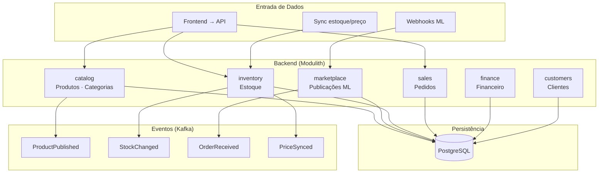

### Agregados principais

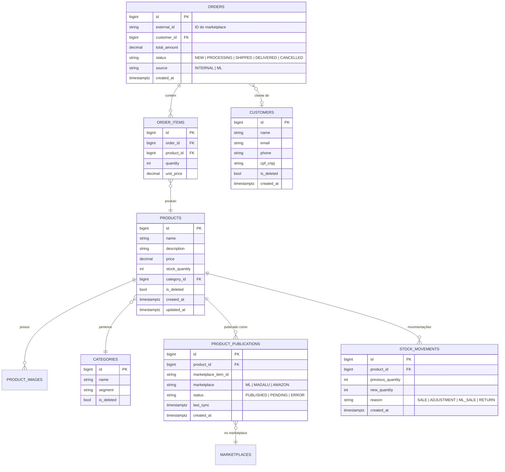

### Ciclo de vida do produto (publicação ML)

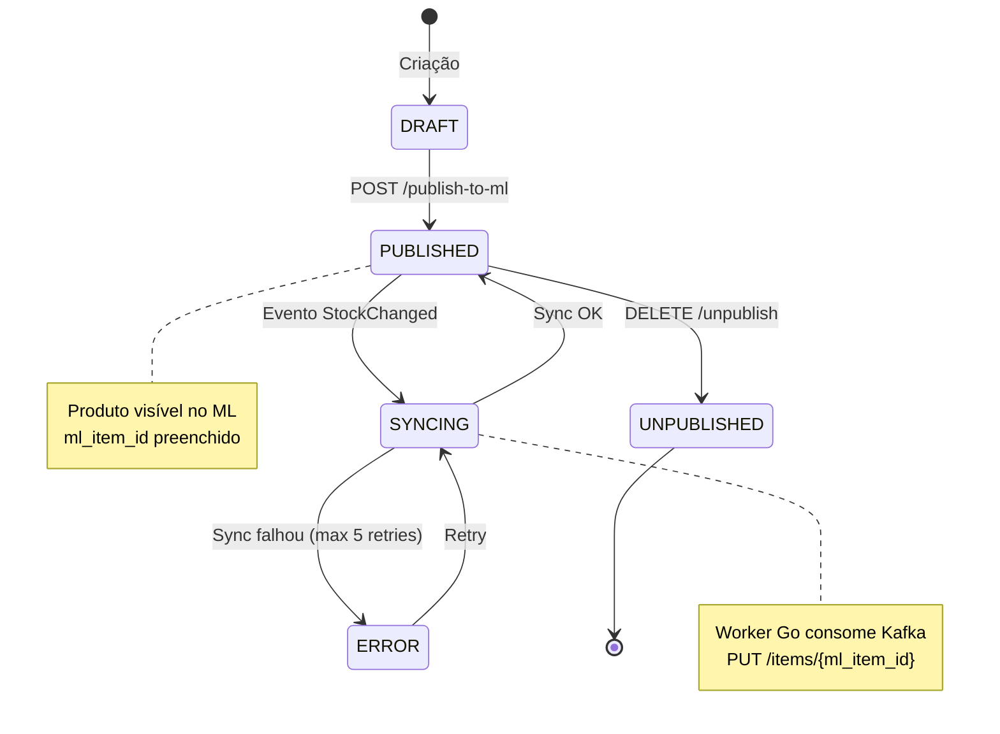

---

## 9. Fluxo de integração ML

### 9.1 Publicação de produto no ML

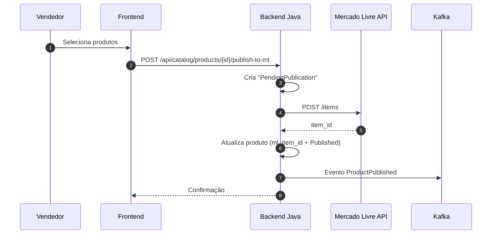

### 9.2 Recebimento de webhook (pedido ML)

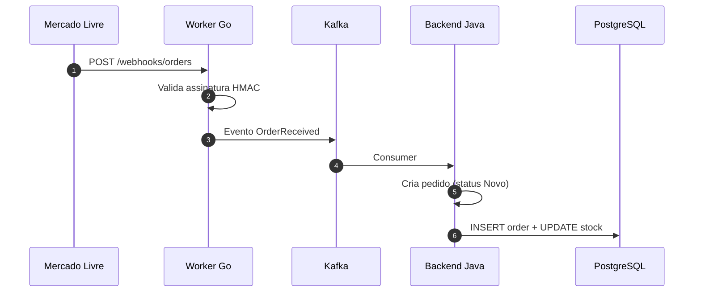

### 9.3 Sync de estoque

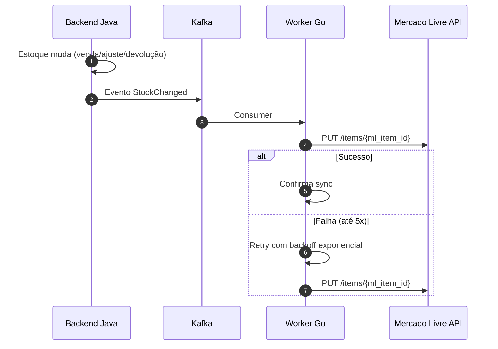

### 9.4 Fluxo de dados completo

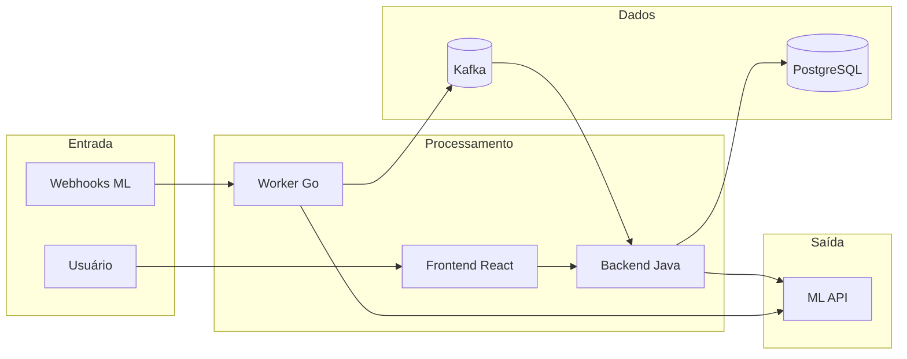

---

## 10. Fluxo de navegação

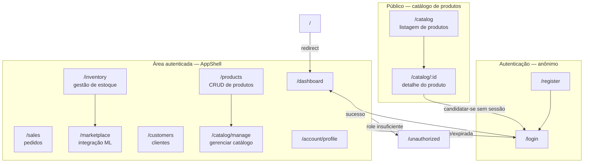

---

## 11. Fluxo de requisições HTTP

### 11.1 Mutação autenticada (publicação de produto)

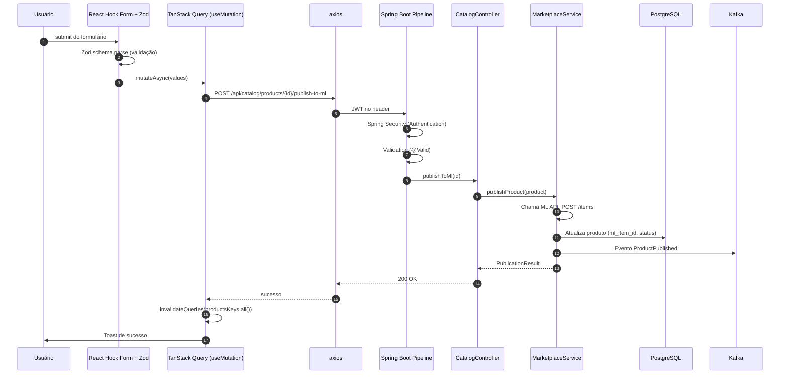

### 11.2 Leitura pública (catálogo de produtos)

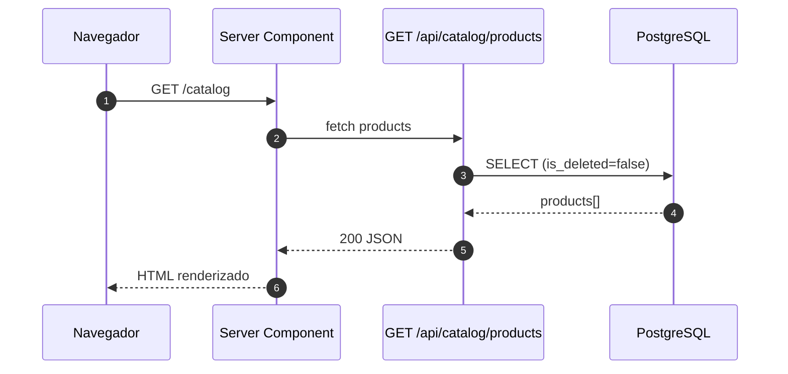

---

## 12. Gerenciamento de estado

### Árvore de providers

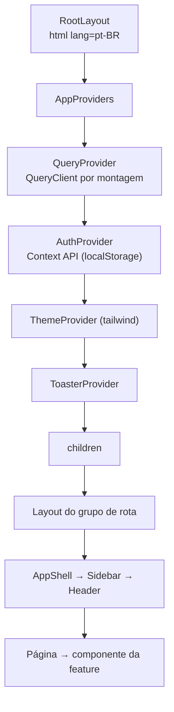

### Hierarquia de estado

| Camada | Onde vive | Responsabilidade |
| ------ | --------- | ---------------- |
| **Server State** | TanStack Query | Cache de dados da API, mutations, invalidação |
| **Global State** | Context API | Auth, tema, config global |
| **Form State** | React Hook Form + Zod | Formulários controlados com validação |
| **Navigation State** | react-router-dom | Rota atual, parâmetros |
| **Local State** | useState / useReducer | UI local de componentes |

---

## 13. Estratégia de cache e eventos

### Camadas de cache

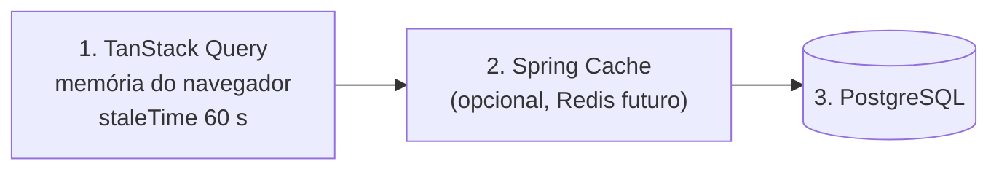

### Fluxo de eventos (Kafka)

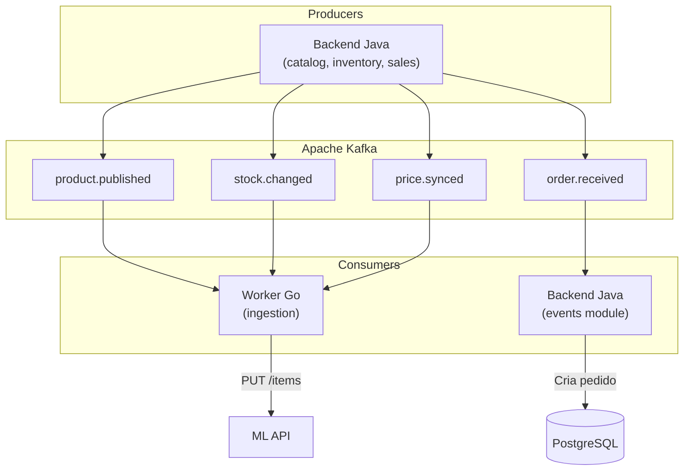

---

## 14. Tratamento de erros

### Contrato de erro — formato padronizado

Todas as respostas de erro da API têm a mesma forma:

```json
{
  "statusCode": 400,
  "code": "VALIDATION_ERROR",
  "message": "Dados inválidos",
  "details": ["Nome é obrigatório", "Preço deve ser > 0"]
}
```

### Tratamento no frontend

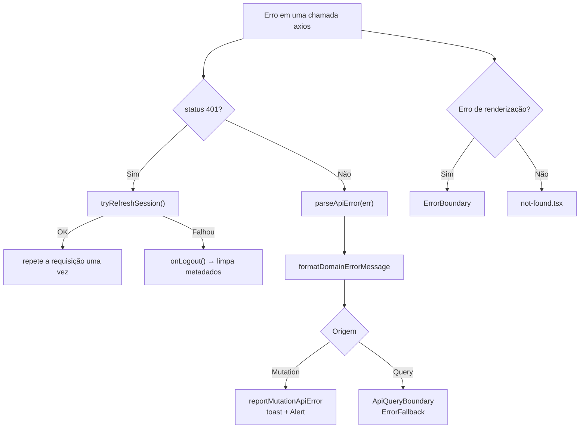

---

## 15. Configurando o ambiente

### Pré-requisitos

| Ferramenta | Versão | Necessário para |
| ---------- | ------ | --------------- |
| JDK | 21+ | Backend |
| Node.js | 20+ | Frontend |
| Go | 1.22+ | Ingestion |
| Docker + Docker Compose | recente | Stack local |
| Maven | (wrapper incluso) | Backend build |

### Passo a passo

**1. Clonar**

```bash
git clone <url-do-repositorio> && cd SG-MULTIDIA
```

**2. Subir infraestrutura**

```bash
docker compose up -d postgres kafka
```

**3. Backend**

```bash
cd backend
.\mvnw.cmd spring-boot:run   # Windows
./mvnw spring-boot:run       # Linux/macOS
```

**4. Frontend**

```bash
cd frontend
npm install
npm run dev
```

**5. Ingestion (opcional)**

```bash
cd ingestion
go run ./cmd/worker
```

### Portas

| Serviço | Porta |
| ------- | ----- |
| Frontend (Vite) | 5173 |
| Backend (API) | 8080 |
| PostgreSQL | 5432 |
| Kafka | 9092 |
| Worker Go | 8081 |

### Variáveis de ambiente

**Backend** (`application.properties` ou env vars):

| Variável | Default | Descrição |
|----------|---------|-----------|
| `spring.datasource.url` | `jdbc:postgresql://localhost:5432/sgmultidia` | URL do banco |
| `spring.datasource.username` | `sgmultidia` | Usuário do banco |
| `spring.datasource.password` | `sgmultidia` | Senha do banco |
| `spring.kafka.bootstrap-servers` | `localhost:9092` | Kafka brokers |
| `SENTRY_DSN` | (vazio) | DSN do Sentry |
| `SENTRY_ENV` | `dev` | Ambiente |

**Ingestion** (env vars):

| Variável | Descrição |
|----------|-----------|
| `KAFKA_BROKERS` | Endereço do Kafka |
| `ML_WEBHOOK_SECRET` | Secret para validação de webhooks |
| `ML_ACCESS_TOKEN` | Token de acesso à API do ML |
| `DATABASE_URL` | Connection string do PostgreSQL |

---

## 16. Executando o projeto

### Opção A — Docker Compose (tudo junto)

```bash
docker compose up --build
```

### Opção B — Desenvolvimento local (recomendado)

Terminal 1 — Infra:
```bash
docker compose up -d postgres kafka
```

Terminal 2 — Backend:
```bash
cd backend && ./mvnw spring-boot:run
```

Terminal 3 — Frontend:
```bash
cd frontend && npm run dev
```

Terminal 4 — Ingestion:
```bash
cd ingestion && go run ./cmd/worker
```

Acesse: `http://localhost:5173`

---

## 17. Build e CI/CD

### Pipeline de build

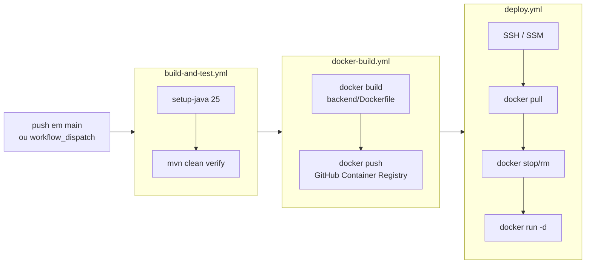

### Harness de validação

```bash
.\harness.ps1                # Windows (todos)
.\harness.ps1 backend        # Só backend
.\harness.ps1 frontend       # Só frontend
.\harness.ps1 ingestion      # Só ingestion
```

### Build local

Backend:
```bash
cd backend && ./mvnw clean package -DskipTests
```

Frontend:
```bash
cd frontend && npm run build
```

Ingestion:
```bash
cd ingestion && go build -o worker ./cmd/worker
```

---

## 18. Convenções do projeto

### Gerais

| Tema | Convenção |
| ---- | --------- |
| Idioma | Documentação em **pt-BR**; código em **inglês** |
| Commits | Conventional Commits: `feat:`, `fix:`, `refactor:`, `docs:`, `perf:` |
| Branch principal | `main` |
| Segredos | **Nunca** no repo. Usar env vars ou Docker Compose `.env` |

### Backend (Java/Spring)

| Tema | Convenção |
| ---- | --------- |
| Modularidade | Pacotes por domínio: `catalog/`, `marketplace/`, `inventory/`, etc. |
| Estrutura do módulo | `<modulo>/api/` (controllers) + `<modulo>/internal/` (services, repos, entities) |
| Nomenclatura | `PascalCase` para classes; `_camelCase` para campos privados |
| Sufixos | `*Controller`, `*Service`, `*Repository`, `*Entity`, `*Exception` |
| Migrations | Flyway, em `src/main/resources/db/migration/` |
| Validação | Bean Validation (annotations) + `@Valid` nos controllers |
| Eventos | Kafka via Spring Kafka; producer e consumer por módulo |
| Transações | `@Transactional` em services; eventos publicados após commit |

### Frontend (React/TypeScript)

| Tema | Convenção |
| ---- | --------- |
| Arquivos | `kebab-case` para módulos; `PascalCase` para componentes |
| Pastas | `kebab-case`; features em `src/features/` |
| Componentes | Um por arquivo, exportado nomeado |
| Tipos | `strict: true`, **`any` proibido** |
| Estilos | Tailwind CSS (utility-first) |
| Forms | React Hook Form + Zod |
| State do servidor | TanStack Query (react-query) |
| Linter | oxlint |

### Ingestion (Go)

| Tema | Convenção |
| ---- | --------- |
| Estrutura | `cmd/worker/` (entry point) + `internal/worker/` (lógica) + `internal/config/` |
| Handlers | Um handler por tipo de evento/webhook |
| Erros | Tratamento com retry + backoff exponencial |
| Config | Via environment variables |

---

## Docs

| Documento | Caminho | Quando usar |
| --------- | ------- |-------------|
| Guia de agents | `CLAUDE.md` | Contexto rápido para IA |
| Workflow dos agents | `docs/agents/README.md` | Pipeline de execução |
| SDD Orchestrator | `docs/sdd/SDD-ORCHESTRATOR.md` | Nova feature (PRD → spec) |
| ADRs | `docs/sdd/adrs/README.md` | Decisões arquiteturais |
| Feature ML | `docs/features/ml-integration/` | Integração Mercado Livre |
| Feature Dashboard | `docs/features/dashboard/` | Dashboard de gestão |
| Skills | `docs/skills/README.md` | Conhecimento especializado |
